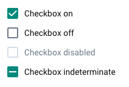
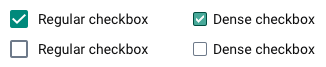
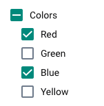

|                      |                                                                                |
| -------------------- | ------------------------------------------------------------------------------ |
| **Component**        | Checkbox                                                                       |
| **Type**             | Atom ([?](http://atomicdesign.bradfrost.com/chapter-2/))                       |
| **Design Spec**      | _pending_                                                                      |
| **Working Examples** | [Link](https://ui.dhis2.nu/demo/?path=/story/forms-checkbox-checkbox--default) |
| **Status**           | `Ready to use`                                                                 |

---

# Checkbox

A checkbox is a control that allows a user to toggle an option.

##### Contents

-   [Usage](#usage)
-   [Options](#options)
-   [States](#states)
-   [Examples in use](#examples-in-use)

---

## Usage

Checkboxes are used when an option can be toggled on or off. Toggling a checkbox on (true) is always considered a positive action and should reflect a positive/true/on state. Multiple checkboxes can be used in a list where a user can toggle multiple elements.

Do not use checkboxes in a list of several options where only a single option can be toggled, use [radio buttons](radio.md) here instead.

If there are many options that need to select from, consider using a [select](../molecules/select.md) instead.

---

## Options

### Size

Checkboxes are available in Regular and Dense sizes. Regular size is usually used in forms and whenever a checkbox, or checkboxes, are used standalone. Dense size checkboxes are used inside other complex components, not as main elements of a UI.

---

## States

The checked/unchecked/disabled states of a checkbox are self-explanatory. Checked state should be use to represent a positive selection, unchecked should indicate 'empty' or 'not chosen'.

### Indeterminate

An indeterminate state is used when some, but not all, of the child elements are selected. This state represents a middle ground between checked/unchecked.

---

## Examples in use

_Checkboxes are used for toggling on/off the display of certain elements. Checkbox status True/On indicates that this element will display, an example of using a checked state for a positive action (displaying that type of element)._
