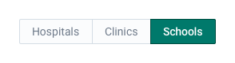
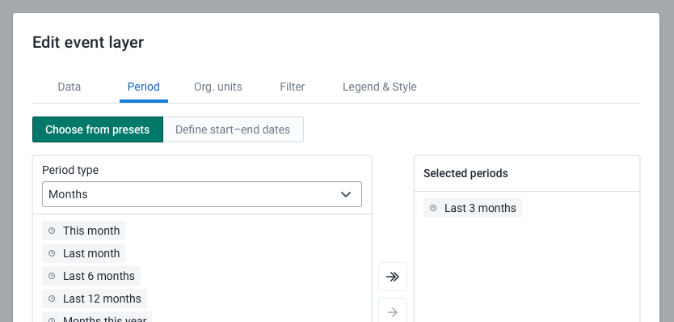

|                      |                                                                   |
| -------------------- | ----------------------------------------------------------------- |
| **Component**        | Segmented Control                                                 |
| **Type**             | Molecule ([?](http://atomicdesign.bradfrost.com/chapter-2/))      |
| **Design Spec**      | [Link](https://sleepy-yalow-3c0c76.netlify.app/segmented-control) |
| **Working Examples** | _pending_                                                         |
| **Status**           | `Waiting for build`                                               |

---

# Segmented Control

Using a segmented control, a user can select between related options. The selection made will change or effect another area of content.

##### Contents

-   [Usage](#usage)
-   [Examples in use](#examples-in-use)

---

## Usage

A segmented control is used to select between options that relate to another area of content. All of the options in a segmented control should be closely related.

Do not use a segmented control as a standalone selection, it should always be used as a selector for other content. For example, do not use a segmented control in place of radio buttons when making a single, standalone choice.

Keep the text label for each option clear and concise. Long labels will make this component difficult to use.

There must always be a selected option. Ensure the default selected option is the most used option where possible.

#### Segmented Control vs. Tabs

A segmented control is similar in functionality to the [tab component](tab.md), however there are differences in their intended usage.

-   Tabs are used to select between several options, usually more than three, that are loosely related. Tabs are a high-level navigational component.
-   A segmented control is used to select between a few options, usually less than three, that are closely related or as part of a single theme. A segmented control is a low-level selection component.

Tabs can be used to provide navigation between several sections of an application, for example. A segmented control might be used to select between difference selection modes inside another component.

---

## Examples in use

_This example illustrates the difference between a segmented control and tab selection. A segmented control is used to select between different modes of period selection: predefined or by start/end dates. The choice here is focused and applies to a single theme. The tabs above provide navigation between the global sections of this options dialog._
