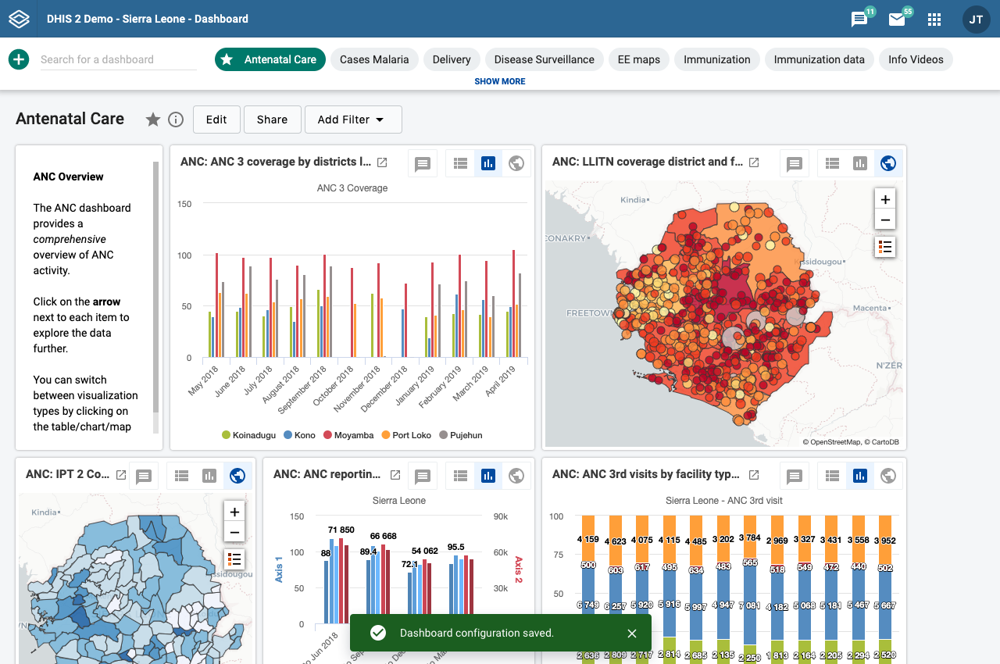

import { Demo } from '../../src/components/DemoComponent.jsx'
import { AlertBar } from '@dhis2/ui'

# Alert Bar

<Demo>
    <AlertBar permanent>Hello world</AlertBar>
</Demo>

A floating alert that informs the user about temporary information in the context of the current screen.

<!--  -->

## Usage

Alert bars notify a user of some information. There are different types of alert bar for displaying different types of content. Use the alert bar type that matches your content type and importance. Note that alert bar can be ignored by the user, so they shouldn't be used for content that needs to block an app flow, use a [modal](modal.md) instead.

Alert bars are always displayed at centered and fixed at the bottom of the screen. Some types of alert bar dismiss after a set time, others must be dismissed by the user.

---

## Options

### Text

Alert bar text should be concise and easy to understand. Avoid confusing, technical error messages. Warnings and problems should include a reason, or a recommended action to fix the problem.

### Actions

Alert bars can have up to two actions. An action can control something on the current page (e.g. "Retry", which retries the previous action) or can link out to an external page (e.g. "View docs", which opens the relevant documentation). External actions should open in a new tab so users do not lose their current position. Alert bar actions should be simple. Do not include complex or multi-step actions.

### Icons

Alert bar icons support the content and give the user a way of quickly understanding the context of the information. Example uses of icons:

-   Wifi/Network icon when informing the user about their network connection.
-   Tick/checkmark when successfully adding a user.
-   ! icon when an error has occurred.

---

## Types

There are several different types of alert bar:

| Type     | Usage                                                                       |
| -------- | --------------------------------------------------------------------------- |
| Info     | Default. Inform the user of neutral content.                                |
| Success  | Confirm a successful action.                                                |
| Warning  | Warn of a potential problem or obstruction, usually before it has happened. |
| Critical | Inform of a catastrophic error or problem, after it has occurred.           |

It is important to use the correct type of alert bar. Users should not be overloaded with warnings that are not actually important, nor should they miss out on important information.

### Info

<Demo>
    <AlertBar permanent>Data export complete.</AlertBar>
</Demo>

The default alert bar that should be used in most situations. An information alert can be used to confirm minor actions instead of a success type. An info alert bar would be used, for example, for:

-   "Sharing settings changed."
-   "Message sent."
-   "Comment edited successfully."
-   "Data export complete."

Info alert bars dismiss automatically after 5 seconds, so the message should not be critical to the users understanding, but rather a useful helper.

### Success

<Demo>
    <AlertBar success permanent>1000 objects updated.</AlertBar>
</Demo>

Success alert bars should be used to confirm successful major actions. Not all successful actions need a success alert bar, only those that are considered "large tasks", such as defining a program or creating a dashboard. Some example success alert bars:

-   "Program configuration saved and updated."
-   "Relationship created successfully."
-   "1000 objects updated."

Success alerts dismiss automatically after 5 seconds, like info alert bars they are simply for confirmation and should not be critical to a users understanding.

### Warning

<Demo>
    <AlertBar warning permanent>Some data is taking a long time to sync.</AlertBar>
</Demo>

Warning alert bars warn users of potential problems. Ideally warnings should be shown before a problem occurs. If a problem has already occurred, a critical type is probably a better choice. Example content for warning alert bars:

-   "Some data is taking a long time to sync."
-   "A form on this page is hidden."
-   "Some stages are incomplete, so this report isn't ready yet."

Warning alerts do not dismiss automatically. They disappear if the warning conditions change (eg. the data that wasn't loading finishes loading) or the user dismisses them.

### Critical

<Demo>
    <AlertBar permanent>There was a problem loading this dashboard.</AlertBar>
</Demo>

Critical alerts are used to highlight a severe problem. They should only be used to inform the user of broken functionality after it has occurred. Critical alerts should be used where the user can still interact with the application even though there is an error. If there is a catastrophic error that requires blocking the application, use a [modal](modal.md) instead. Critical alert text should inform the user what happened and why. Sample critical alert bars:

-   "There was a problem loading this dashboard."
-   "Relationship not created, invalid relationship type."
-   "Message failed to send because there is no connection."

Critical alerts do not dismiss automatically. A user can dismiss them.

---

## Examples in use

_An alert bar confirms to the user that their dashboard was saved after they carried out changes. The changes might not be immediately visible, so it is useful to inform the user with an alert bar._
