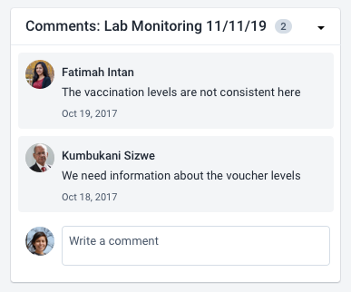

import { Demo } from '../../DemoComponent.jsx'
import { UserAvatar } from '@dhis2/ui'

# Avatar

An avatar is a visual icon that represents a user.

<Demo>
    <UserAvatar name="Karimbe Olefeme"/>
</Demo>

---

## Usage

Avatars are used to give extra information when a user is mentioned or displayed in DHIS2. The avatar contains either user uploaded photograph, initials or a default icon. The avatar is intended to give context to a user and help to quickly identify different users. An avatar is usually shown alongside the user name, but can be used alone to show a visual hint of a user.

---

## Options

### Sizes

<Demo>
    <UserAvatar extrasmall name="Example Person"/>
    <UserAvatar  name="Example Person"/>
    <UserAvatar medium name="Example Person"/>
    <UserAvatar large name="Example Person"/>
    <UserAvatar extralarge name="Example Person"/>
</Demo>

Avatars are available in five sizes. The default size is `medium`. Use the size avatar that represents how important the user information is. Often an avatar is supporting information, so it doesn't need to be displayed too large.

<!-- ---

## Types

There are different types of avatar depending on the metadata available for a user. If available, the default avatar displays the user uploaded profile picture. If a profile picture is not available the user initials are displayed (JC for Joe Cooper). If the user initials are not available, or there are issues with the character-set (for example, non-latin characters), a default icon is displayed instead. -->

---

## Examples in use

_Avatars are used in comments to quickly understand that these comments belong to different users, without needing to read the username. The users own avatar is used to show that they can input data here too._
