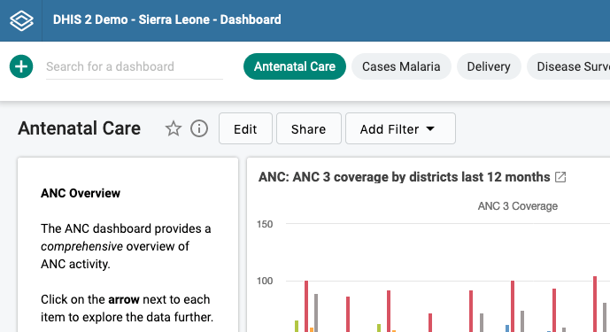

import { Demo } from '../../DemoComponent.jsx'
import { Button, DropdownButton, SplitButton, IconCheckmark24 } from '@dhis2/ui'

# Button

<Demo>
    <Button>Enroll in program</Button>
</Demo>

Buttons are used for triggering actions. There are different types of buttons in the design system which are intended for different types of actions.

## Usage

Each type of button has a specific usage:

| Type          | View                                      | Usage                                                                                                                                                                                                                                                                                                                                                  |
| ------------- | ----------------------------------------- | ------------------------------------------------------------------------------------------------------------------------------------------------------------------------------------------------------------------------------------------------------------------------------------------------------------------------------------------------------ |
| `Basic`       | <Button>Basic</Button>                    | The most often used button that will suit the majority of actions. Should be the default choice. Several basic buttons can be in the same area.                                                                                                                                                                                                        |
| `Primary`     | <Button primary>Primary</Button>          | Used to highlight the most important/main action on a page. A 'Save' button for a form page should be primary, for example. Use sparingly, rarely should there be more than a single primary button per page.                                                                                                                                          |
| `Secondary`   | <Button secondary>Secondary</Button>      | Used for passive actions, often as an alternative to the primary action. If 'Save' is primary, 'Cancel' could be secondary. Not intended to draw user attention. Do not use for the only action on a page.                                                                                                                                             |
| `Destructive` | <Button destructive>Destructive</Button>  | Used instead of a primary button when the main action is destructive in nature. Used to highlight to the user the seriousness of the action. **Destructive buttons must only be used for destructive actions.**                                                                                                                                        |
| `Dropdown`    | <DropdownButton>Dropdown</DropdownButton> | Presents several actions to a user in a small space. Can replace single, individual buttons. Should only be used for actions that are related to one another. Ensure the button has a useful level that communicates that actions are contained within. Dropdown buttons do not have an explicit action, only expanding the list of contained actions. |
| `Split`       | <SplitButton>Main action</SplitButton>    | Similar to the dropdown button, but can be triggered independently of opening the contained action list. The main action may be 'Save' and the contained actions may be "Save and add another" and "Save and open".                                                                                                                                    |
| `Text`        | <Button text>Text</Button>                | Text only button. This style of button should only be used for auxiliary actions, for example clearing the content of an input. Text only buttons should not be used for main actions.                                                                                                                                                                 |

### Button label

Make sure the button's action is a clear verb. "Save" is clear, it could be even clearer if what is being saved is specified, "Save data", for example. Remember that some languages can be 3x longer than english, so specifying a fixed width will not work.

Avoid ambiguous labels like 'Ok', using an action verb will make it clearer to the user what action will come from clicking the button.

---

## Options

### Toggle

<Demo>
    <Button icon={<IconCheckmark24/>}></Button>
    <Button icon={<IconCheckmark24/>} toggled></Button>
</Demo>

A button can represent an on/off state using the toggle option. Use a toggle button when the user can enable or disable an option and a checkbox or switch is not suitable. This will most often be in the case of a toolbar, such as bold or italic options in a text editing toolbar. A toggle button in this example uses an icon and does not need text. A text label should be provided in a tooltip on hover. The toggle option is available for basic and secondary type buttons.

### Icons

<Demo>
    <Button icon={<IconCheckmark24/>}>Mark as complete</Button>
</Demo>

Icons can be included in Basic, Primary, Secondary and Destructive buttons. Use an icon to supplement the text label. Remember that the user may not be fluent in the working language, so an accompanying icon on an important action can be a welcome addition. Buttons with icons only should be used for supplementary actions and should include a text tooltip on hover.

### Size

<Demo>
    <Button small>Small</Button>
    <Button>Default</Button>
    <Button large>Large</Button>
</Demo>

Buttons are available in three sizes: `small`, `medium`, `large`. Medium is usually the correct choice. Use small button in an information dense ui. Large buttons can be use on very simple, single action pages.

---

## States

### Disabled

<Demo>
    <Button disabled>Enroll in program</Button>
</Demo>

Use disabled buttons when an action is being prevented for some reason. Always communicate to the user why the button can't be clicked. This can be done through a tooltip on hover, or with supplementary text underneath the button. Do not change the button label between disabled/enabled states.

---

## Examples in use

_Buttons are used on a dashboard to present the main actions: entering edit mode, sharing the dashboard and adding filters_
