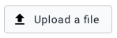
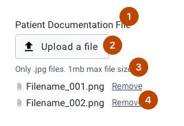
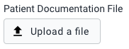
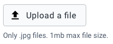
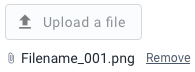
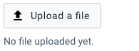
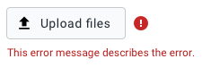
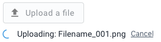

|                      |                                                                                    |
| -------------------- | ---------------------------------------------------------------------------------- |
| **Component**        | File Input                                                                         |
| **Type**             | Atom ([?](http://atomicdesign.bradfrost.com/chapter-2/))                           |
| **Design Spec**      | [Link](https://sketch.cloud/s/DwkDk/a/jWp5Oz)                                      |
| **Working Examples** | [Link](https://ui.dhis2.nu/demo/?path=/story/forms-file-input-file-input--default) |
| **Status**           | `Ready to use`                                                                     |

---

# File Input

The file input component allows users to select and upload files from their local machine.

##### Contents

-   [Usage](#usage)
-   [Composition](#composition)
-   [Options](#options)
-   [Types](#types)
-   [States](#states)

---

## Usage

Use a file input component in forms and interfaces wherever a user needs to be able to select and upload a file from their local machine.

---

## Composition

A file input is made up of multiple elements, some of which are optional:

1. **Label, optional:** A short text to identify what the file is, or relates to.
2. **Input button, required:** The input control for selecting a file.
3. **Help text, optional:** Informative text to advise the user of restrictions.
4. **File list, required:** Display which files have been selected and/or uploaded.

---

## Options

### Label

An optional label can be included. Use a label where it makes sense, especially when using a file input component as part of a form with other inputs.

### Help text

It is important to include help text to inform the user what files are acceptable to upload. Do not wait for the user to select a problematic file to reveal limitations and requirements. If the upload only accepts .jpg files under 1mb, tell the user this up front.

### File list

The filename of successfully uploaded files, or files queued for upload, are displayed in the file list. Each file in the list has a control to remove that file.

#### File list placeholder text

Placeholder text can also be included in place of the file list, before a file has been uploaded. This text can be customized. In the above example 'No files uploaded yet.' is included as placeholder text. This text is useful for making the current component state completely obvious to the user. Placeholder text is optional, but highly recommended.

### Button text

The button text and icon can be customized. Ensure the text makes sense and is an action verb. For example 'Upload a file', 'Add patient records', 'Upload a photo' and so on.

---

## Types

### Single vs. Multiple file upload

Where multiple files can be uploaded by a single file input component, those file names are stacked in the file list in the order they were selected (newest last). All files in the file list have their own remove control and loading indicators.

If a file input is set to accept one file only, the button will be disabled when a file has been selected/uploaded.

---

## States

~If this component has states, why?~

### Error

Error messages appear below the file input button and above the file list, if one exists. An icon is also shown to draw user attention to the error. Make sure to follow the [guidelines for writing helpful error messages](https://github.com/dhis2/design-system/blob/master/principles/content-communication.md#error-messages).

### Loading progress

It is important to communicate to the user that a file is in the process of being uploaded, but hasn't finished yet. It is important that any forms or page actions are not submitted in this time.

Upload progress is shown with a circular loader and 'Uploading:' text in front of the filename. Where possible a cancel action should be included.
