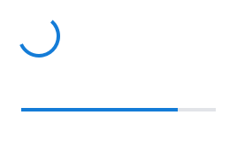
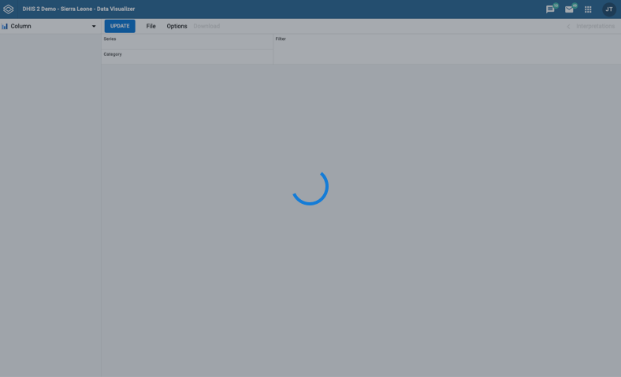
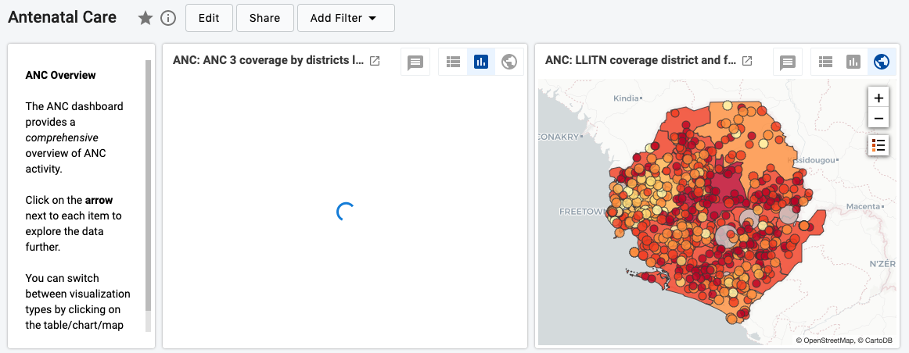
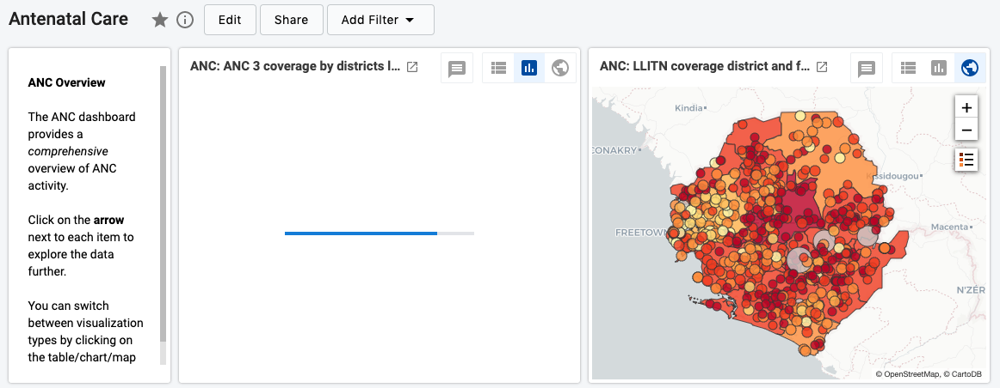

|                      |                                                                                                    |
| -------------------- | -------------------------------------------------------------------------------------------------- |
| **Component**        | Loader                                                                                             |
| **Type**             | Atom ([?](http://atomicdesign.bradfrost.com/chapter-2/))                                           |
| **Design Spec**      | _pending_                                                                                          |
| **Working Examples** | [Link](https://ui.dhis2.nu/demo/?path=/story/feedback-loading-indicators-circular-loader--default) |
| **Status**           | `Ready to use`                                                                                     |

---

# Loader

Loaders are used to inform the user that an element is in a loading state. This could apply to a single component, multiple components, or the entire application/page.

##### Contents

-   [Usage](#usage)
-   [Types](#types)

---

## Usage

Use loading indicators whenever a component or application takes longer than 700ms to load. After this time a loader should be displayed so that the user can understand what is happening: loading is in progress. Consider that without a loading indicator a user would be unsure of their current status, so they are important UI elements.

---

## Types

There are different types of loader, circular and linear, and both can be used in different ways. The general rule to follow:

| Loader   | Usage                                                                                                       |
| -------- | ----------------------------------------------------------------------------------------------------------- |
| Circular | Indeterminate loading, e.g. when the loading time is uncertain and cannot be communicated with a percentage |
| Linear   | Determinate loading, e.g. when the loading process can be communicated from 0–100%.                         |

### Circular

A circular loader is used when the loading time is uncertain and cannot be displayed as a percentage. A circular loader can spin many times, and each spin does not represent any amount of completion.

#### Circular Page Loader

A circular loader can be used to indicate loading of an entire application. A circular loader is always combined with a ScreenCover which prevents the user from interacting with the application. Page loaders are always centered in the viewport. Use a 'Large' size loader for page loaders. If some components have loaded but not others, display Component Loaders instead (see below), and let the user interact with the available components.

_This page loader covers the whole screen while the application loads._

#### Circular Component Loader

Component loaders are used to indicate a loading state for an individual component, for example a dashboard item. Components loaders are useful to inform the user that while the application/page has loaded, not all the elements are ready yet. Without a component loader a user can mistakenly think that data is missing or an error has occurred. Circular component loaders should always be centered in the component and include a ComponentCover element to block the content beneath. Use 'Small' size loader for Component Loaders.

_An example of a dashboard item that has not loaded yet, so displays a component loader inside._

### Linear

Linear loaders are used when the percentage loaded is known and be shown to the user. They can be used in the same page/component variations as circular loaders.

_A dashboard item with a linear loader, which shows the user the approximate progress of the loading._
