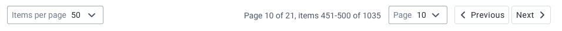
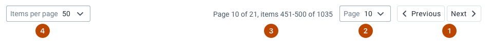
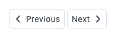
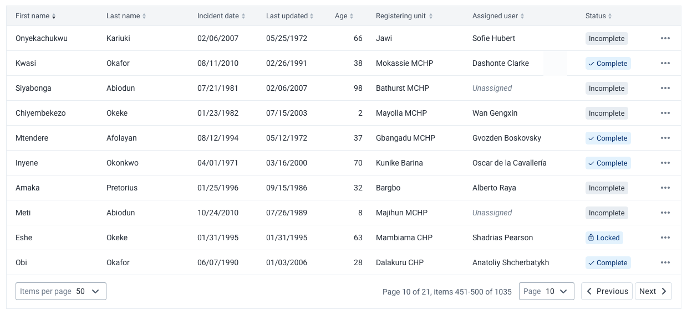

|                      |                                                                                |
| -------------------- | ------------------------------------------------------------------------------ |
| **Component**        | Pagination                                                                     |
| **Type**             | Molecule ([?](http://atomicdesign.bradfrost.com/chapter-2/))                   |
| **Design Spec**      | [Link](https://www.sketch.com/s/3b3cacfc-bde2-4f89-ab9f-3ffc05cfd34d/a/AlV1YR) |
| **Working Examples** | [Link](https://ui.dhis2.nu/demo/?path=/story/navigation-pagination--default)   |
| **Status**           | `Ready to use`                                                                 |

---

# Pagination

Pagination is used to allow navigation through data displayed over several pages.

##### Contents

-   [Usage](#usage)
-   [Composition](#composition)
-   [Options](#options)
-   [Types](#types)
-   [Examples in use](#examples-in-use)

---

## Usage

Pagination allows data to be split in pages. Paging large amounts of data avoids overwhelming users and should always be used wherever a lot of data is displayed. Pagination controls allow a user to browse through a set of data or navigate to a specific page depending on the type of pagination used.

**Do not rely on pagination for navigating datasets. A user should be able to search within, sort and filter datasets too, rather than needing to click through many pages looking for the right data item.**

---

## Composition

The pagination component is made up of several elements, some of which are optional:

1. **Previous & Next buttons, required**
2. **Page control dropdown, optional**
3. **Context information, optional**
4. **Result count selector, optional**

---

## Options

### Page control dropdown

The page control dropdown allows quick access to any page of the data without needing to use the previous and next buttons. The page control dropdown should be included if a user might need to jump around between pages often. Do not include the dropdown unless there is an identified need, it adds visual noise and complexity to the component.

### Context information

Context information helps the user understand where they are in within a large dataset. Include context information whenever it is important to a user to understand how the data they are viewing relates to the dataset as a whole. Do not include the context information unless there is an identified need, it adds visual noise and complexity to the component.

### Result count selector

The result count selector allows a user to adjust the number of data items displayed in the component that the pagination relates to. Use a result count selector wherever a user might want to customize their view of the data. Remember that allowing large counts may negatively affect users on slow connections.

---

## Types

There are no strict types of pagination component, the different optional elements can be included individually. This allows the component to be as flexible as possible. The most often used 'types' of pagination are Compact and Full, explained below.

### Compact

Smaller datasets might not need full pagination controls. Only including the previous and next buttons results in a simple, compact component.

### Full pagination

Including all of the pagination elements results in a full-featured pagination control, useful to managing large datasets.

---

## Examples in use

_Full pagination is used to view and navigate search results in Capture app._
