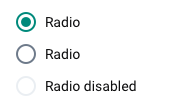
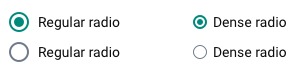
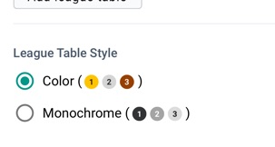

|                      |                                                                          |
| -------------------- | ------------------------------------------------------------------------ |
| **Component**        | Radio                                                                    |
| **Type**             | Atom ([?](http://atomicdesign.bradfrost.com/chapter-2/))                 |
| **Design Spec**      | _pending_                                                                |
| **Working Examples** | [Link](https://ui.dhis2.nu/demo/?path=/story/forms-radio-radio--default) |
| **Status**           | `Ready to use`                                                           |

---

# Radio

A radio button is a control that allows a user to select a single option from a choice of several.

##### Contents

-   [Usage](#usage)
-   [Options](#options)
-   [Examples in use](#examples-in-use)

---

## Usage

Radio buttons are used where a user has the choice of several options but must select only one. Radio buttons should be used where the user has to make a choice, there is no 'off' or 'none' state unless explicitly defined. Radio buttons should be used when there are 5 or less options available. With more than five a dropdown/select menu should be used instead.

Do not use a radio button if only a single option is available, use a [checkbox](checkbox.md) here instead.

If there are many options that need to select from, consider using a [select](../molecules/select.md) instead.

---

## Options

### Size

Radio buttons are available in Regular and Dense sizes. Regular size is usually used in forms and whenever radio buttons are used standalone. Dense size radio buttons are used inside other complex components, not as main elements of a UI.

---

## Examples in use

_Only a single style can be chosen from the options and there are fewer than 5 options, so radio buttons suit this usage._
