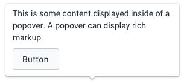

|                      |                                                                             |
| -------------------- | --------------------------------------------------------------------------- |
| **Component**        | Popover                                                                     |
| **Type**             | Molecule ([?](http://atomicdesign.bradfrost.com/chapter-2/))                |
| **Design Spec**      | [Link](https://sketch.cloud/s/DwkDk/eKeoaxx)                                |
| **Working Examples** | [Link](https://ui.dhis2.nu/demo/?path=/story/data-display-popover--default) |
| **Status**           | `Ready to use`                                                              |

---

# Popover

A popover displays extra content to a user. Popovers are useful to give a user more information or possible actions without disrupting a page or flow.

##### Contents

-   [Usage](#usage)
-   [Options](#options)
-   [Examples in use](#examples-in-use)

---

## Usage

Popovers are similar to [tooltips](../atoms/tooltip.md), they are for displaying extra information, but popovers are intended for richer information and actions.

Popovers are triggered by hovering or tapping on an element. Clicking on a element keeps the popover open until the user clicks or interacts elsewhere on the page.

Popovers can contain information in the form of rich markup, as well as actions. Critical actions, or the only action on a page, should not be hidden behind inside a popover.

Before using a popover, consider that some users may never see the information contained within. If that is a problem, display the information right on the page instead. Do not use a popover for content that is essential to the user experience or application.

---

## Options

### Placement

By default popovers are displayed above the target element. Where space is limited, or where it may make sense,the popover can appear below or to the side of an element.

---

## Examples in use

_This popover displays useful information about a data element in a form. A user might not need this information daily, but it is useful to be able to access for new users or those that need a reminder. A popover serves this purpose well._
