|                      |                                                                     |
| -------------------- | ------------------------------------------------------------------- |
| **Component**        | Data table                                                          |
| **Type**             | Organism ([?](http://atomicdesign.bradfrost.com/chapter-2/))        |
| **Design Spec**      | [HTML&CSS spec](https://sleepy-yalow-3c0c76.netlify.com/data-table) |
| **Working Examples** | _pending_                                                           |
| **Status**           | `Work in progress`                                                  |

---

# Data table

A data table is used to display data in a structured way. Data tables have functionality for viewing and manipulating data.

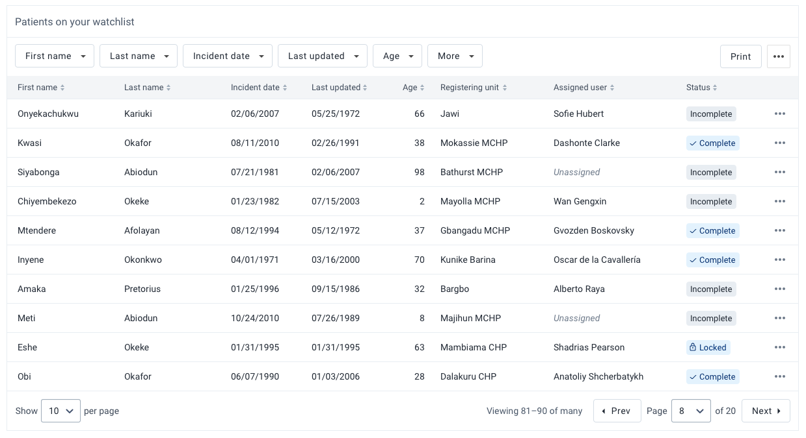

##### Contents

-   [Usage](#usage)
-   [Composition](#composition)
-   [Options](#options)
-   [Types](#types)
-   [States](#states)
    <!-- - [Examples in use](#examples-in-use) -->

---

## Usage

Displaying data in a structured way aids understanding and highlights relationships in data sets. Data tables allow the user to see detailed information about data sets. Each record in a data table can be viewed, interacted with and manipulated.

Data tables should only be presented to the user when needed. A data table full of complex data can be overwhelming. Before using a data table, consider whether an application could parse and display the information in a more user-friendly, understandable way. In cases where the user wants to see all of the data available, a data table is perfect.

There are several different types of functionality and options available in the data table component. The correct data table to use will depend on the use case and type of data being displayed. The functionality and options available in the data table component are highlighted and discussed below.

---

## Composition

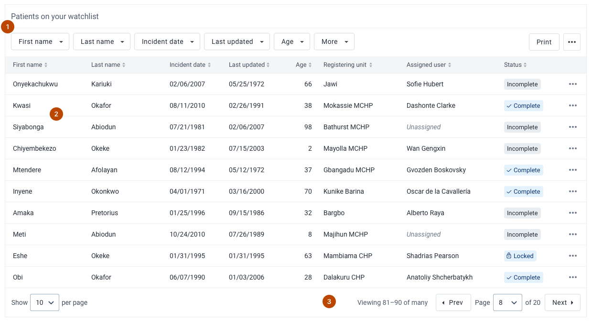

A data table is made up of multiple elements, some of which are optional:

1. **Toolbar, optional**
2. **Data rows and header, required**
3. **Footer, optional**

---

## Options

### Search

##### What is search?

Search allows a user to search for a specific term across the entire data table.

##### How is search used?

A search input can be included inside the table toolbar area or made available outside of the table. The location of the search input depends on the importance of search and how it relates to the task. If searching is a logical step performed before looking at the table the input should be shown outside, above the table. If searching is a secondary action it can be included inside the table.

Be sure to inform the user with an [empty state](#empty-state) if there are no results for a search term.

##### When to use search?

Include search whenever a user might need to find a specific data record in the table. Search can be quicker than filtering if the user knows the exact data item they are looking for. Often search and filtering work well in combination.

---

### Filtering

Filters allow a user to view a precise, focused set of data. Filtering is a very effective way of finding the right data. Enabling filtering on a data table means that a single data table can fulfill several different functions for varying users and use cases.

Filtering works best when a user wants to return multiple results that fit some criteria. If a user is looking for a single result, especially where they know a name/title/attribute, then provide search functionality outside of the table.

Never filter data in a table without informing the user, the user must know they are viewing a filtered set of data.

There are two ways to filter data in a data table: [standalone](#filtering-standalone) or [inline](#filtering-inline).

### Filtering: Standalone

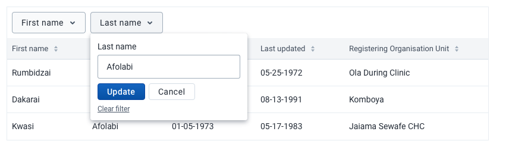

##### What are standalone filters?

Standalone filters are buttons that can be used to filter on a column in a data table.

##### How are standalone filters used?

Standalone filter buttons should be displayed inside the table toolbar area. The available filters must be defined, none will be provided by default. Clicking a filter button opens a popover with input controls. An actively filtered column is highlighted with an active button and text indicating the applied filter.

##### When to use standalone filters?

Standalone filters are useful when filtering is one of the main actions available on the page. Standalone filters will draw the user's attention and are easier to use for users with lower tech literacy. Only provide standalone filters that are useful to the user, as filter buttons add visual noise and potential confusion to a data table.

### Filtering: Inline

##### What are inline filters?

Inline filter controls are a compact way to filter data in the data table.

##### How are inline filters used?

The filter input for a column is displayed by clicking the filter icon in the column header. Multiple columns can be filtered at the same time.

##### When to use inline filters?

Use inline filters in data-heavy, compact tables where standalone filters would take too much space. Inline filters are useful when filtering is not one of the main actions on a page, but is a tool that will be used occasionally.

---

### Table actions

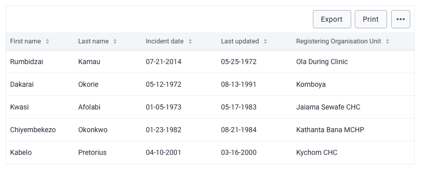

##### What are table actions?

Actions that can be applied to the entire data table or the currently selected data rows.

##### How are table actions used?

Table actions are presented as buttons in the toolbar area. Important, often used table actions can be displayed as individual buttons: 'Export' and 'Print' in the example above. Other secondary options contained within a dropdown button. Use a button label like 'Actions', 'More' or the three-dot icon.

##### When to use table actions?

Only include actions in the toolbar that apply directly to the data in the data table, not to the rest of the interface.

Table action buttons will be very visible to the user, so only include actions here that will apply to most use cases. Edge case or rarely used options should be accessed through the overflow menu to avoid overwhelming users with options.

---

### Row actions

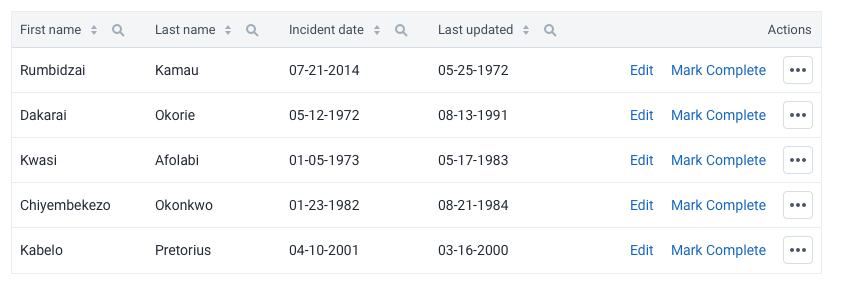

##### What are row actions?

Actions that apply to a single row in a data table.

##### How are row actions used?

Row actions are usually displayed as the last column in a row. Main row actions can be displayed as text links in the row. A maximum of 2 main row actions can be shown in a table row. Other actions are made available through the 'three-dots' overflow menu.

A click action can be also be set for all rows that will be activated by clicking on that row. For example, clicking on a row may activate 'View' action and navigate to that row on a new page.

##### When to use row actions?

Row actions add a lot of potential action points to a page, so use them with care. Only use text link row actions where that action needs to be available for all rows at all times. Secondary, less important, actions available through the overflow menu can be included anytime it is useful for users to take action when viewing the data table.

---

### Sorting/Ordering

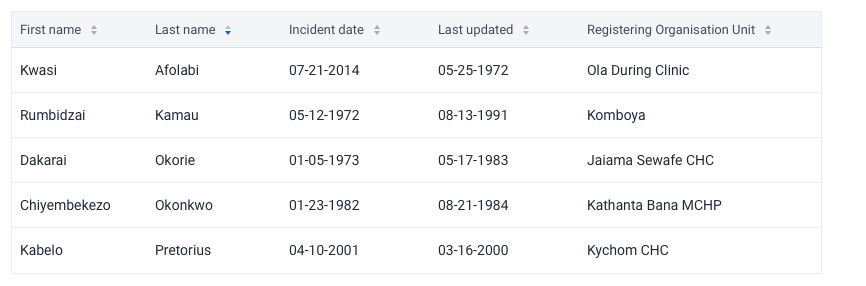

##### What is sorting/ordering?

Sorting/ordering allows the user to reorder the rows in a data table based on column contents. The column can be sorted ascending or descending.

##### How is sorting/ordering used?

Column headings can be clicked to enable sorting by that column. The direction of sorting is indicated by a highlighted icon. Clicking a column heading multiple times toggles ascending/descending/off.

##### When to use sorting/ordering?

Sorting is often useful and should be enabled for most data tables. Only disable sorting if the order of the displayed data is intentional or meaningful and therefore should not be changed by a user.

---

### Fixed header

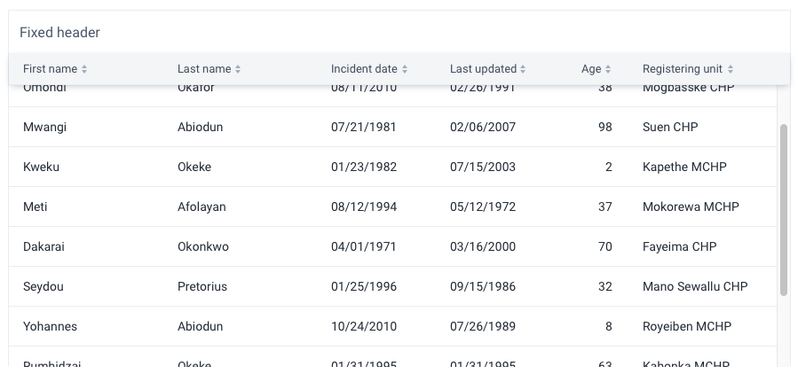

##### What is a fixed header?

A table header that remains in view when vertically scrolling a data table. If displayed, a table toolbar will also be fixed.

##### When to use a fixed header?

Fixed headers are useful for browsing data in limited space where the header would otherwise be hidden and users may not remember the content of each column. A fixed header ensures users always have context for the table data.

---

### Fixed columns

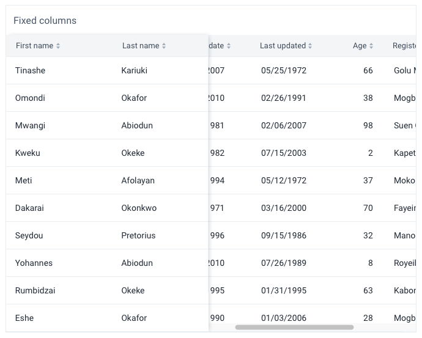

##### What are fixed columns?

Columns in a data table that remain in view when a table horizontally scrolls. In the above example, the first two columns are fixed and the rest of the table scrolls horizontally.

##### When to use fixed columns?

Use fixed columns where space is limited and a user may need to scroll the table horizontally. Keeping a column(s) fixed helps the user to understand which row they are viewing/editing when scrolling.

---

### Inline editing

##### What is inline editing?

Cells or rows can be edited directly in the data table without navigating to another page.

##### How is inline editing used?

###### Cells

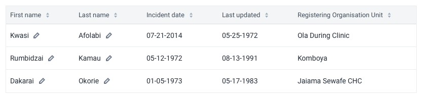

If a single cell is editable it will display an edit icon inside the cell, after the value.

Clicking an editable cell opens a popover where editing controls can be presented. No default controls are present here, so use the relevant inputs for the type of data being editing. Always make it clear to the user how they save their data: is their data saved automatically or do they have to click a 'Save' button. Providing a 'Save' button is a straightforward and easily understandable pattern to follow.

Clicking an editable cell triggers the edit process. The interface for editing needs to match the use case:

-   editing a single, focused value: display a popover with inputs and buttons,
    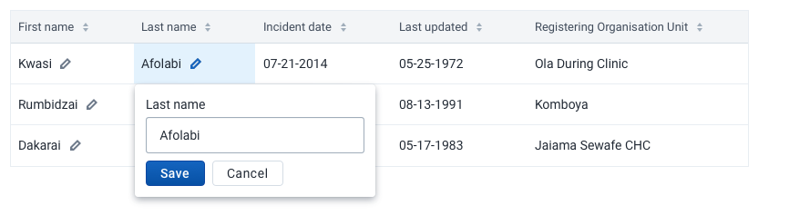
-   editing a complex value: display a modal with all the required inputs.

###### Rows

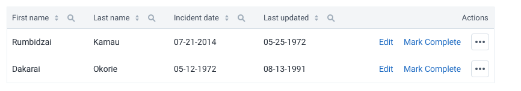

Edit control for an entire row should be displayed as a row action. Like cells, the interface for editing should match the use case:

-   editing simple values in a row: each cell in the row can display an input control with save and cancel buttons in the last cell. When a row is in edit mode the other actions in the table should be disabled,
    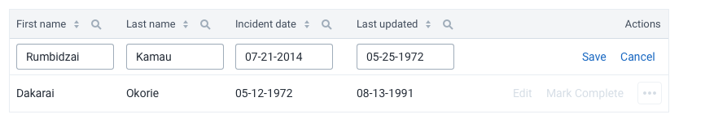
-   editing complex values in a row: open a modal view that displays all the relevant controls.

##### When to use inline editing?

Inline editing should be used with restraint. It can be useful for power users, they can quickly edit values without leaving the data table. However, it can be overwhelming for some users and can be particularly difficult when working with large data sets. Consider network conditions, an unreliable network can make inline editing difficult as the distinction between saved, synced or failed is not always clear to a user.

---

### Expandable rows

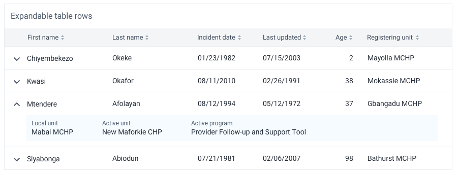

##### What are expandable rows?

Expandable rows are table rows that can be expanded inline, without leaving the page, to reveal more information and actions.

##### How are expandable rows used?

The user can expand a row by clicking on the arrow in the left-most area of the row. Alternatively, the default click action could expand the row.

##### When to use expandable rows?

Expandable rows are useful when there is a lot of useful information to display, more than would fit in a table row on a normal-sized screen. A row that can expand can show this useful information to a user without leaving the page, so this pattern works well for reference screens where a user might be checking many pieces of information. Expandable rows also work well for displaying information that cannot easily be shown inside a table row: paragraphs of text or videos, for example.

---

### Selectable rows

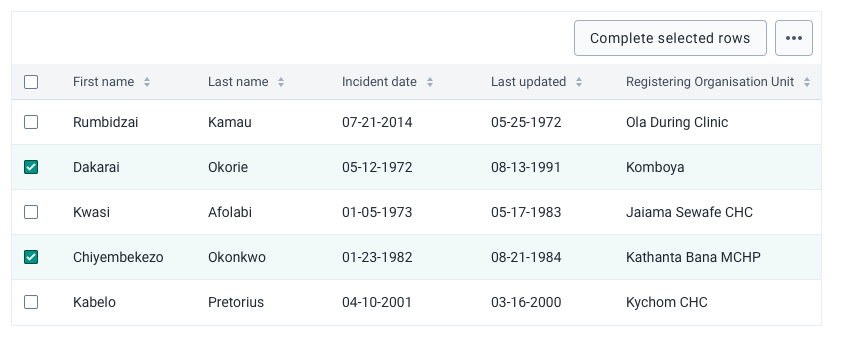

##### What are selectable rows?

Selectable rows allow the user to select/mark one or more rows in a data table.

##### How are selectable rows used?

Rows are selected via a checkbox or radio button in each row. If using checkboxes, a checkbox control is also present in the header, clicking this checkbox selects all visible rows.

Selected rows can have actions applied to them from the Table Actions. In the above example, the 'Remove selected' button becomes active when one or more rows are selected. When no rows are selected this action is disabled. This is useful for performing actions on some, but not all rows.

If only one row can be selected the rows will have a radio button control. If multiple rows can be selected the rows will have a checkbox control.

##### When to use selectable rows?

Use selectable rows with checkboxes to allow users to act on one or more rows easily. Do not enable selectable rows if there are no actions to perform.

Use a single selectable row (radio button) when a user needs to choose an option from a data table. Think carefully if a data table is the correct way to display the options, would a dropdown or a simpler list work? Only use a single selectable row if the user needs to see/manipulate all of the data when making a choice.

---

### Reordering rows

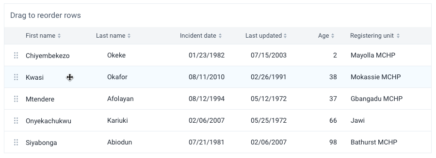

##### What is row reordering?

Row reordering allows a user to drag and drop data table rows to change their order.

##### How is row reordering used?

When row reordering is enabled the primary action (e.g. clicking the row) will always activate the drag and drop functionality. If the row requires more actions they must be included as inline [row actions](#row-actions).

##### When to use row reordering?

Row reordering should only be used where it will have a lasting, meaningful effect on the data in the data table. Do not use row reordering for temporarily sorting data in a table.

---

### Editable columns

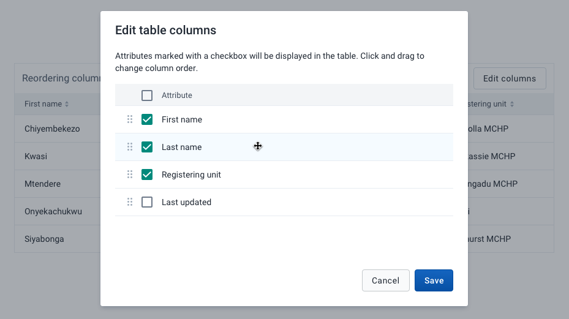

##### What are editable columns?

Editable columns allow users to change which columns to display, and their ordering, in a data table.

##### How are editable columns used?

If column editing is enabled a button will be shown in the Table Actions. This button opens a modal view with controls for toggling on/off and reordering columns.

##### When to use editable columns?

Allowing users to edit column visibility and ordering can be useful for creating flexible data tables that need to show different data to different types of users. A single data table can fulfill many different needs and purposes.

However, do not include editable columns by default. There must be an identified use case. Editing columns is advanced functionality and can be intimidating for some users, so it should be used with care.

---

### Bordered cells

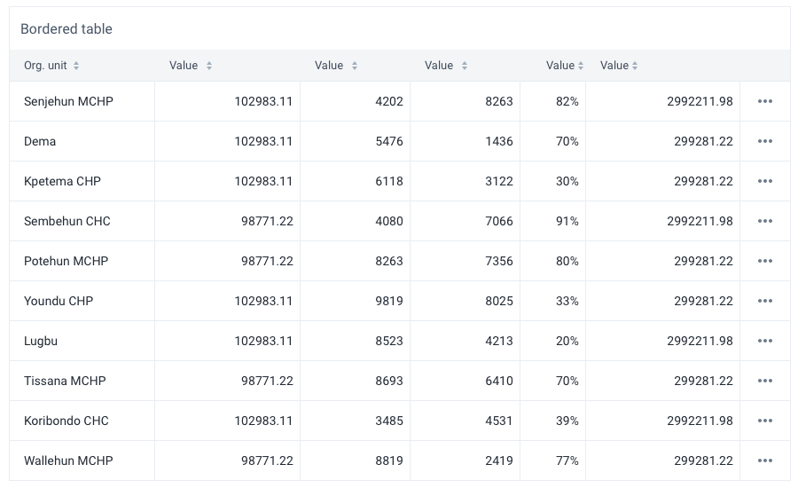

Bordered cells are useful when displaying very complex data that may have similar values. For example, a table that displays only number values is best shown with borders to help visually separate the values. Tables where rows represent one 'record' with different value types (name, address, age, etc.) do not need borders.

---

### Built-in formatting

Several built-in text styles are available for cells. Technically any type of content can be input into a table cell, but using these styles where possible helps to build a consistent DHIS2 platform.

---

### Status

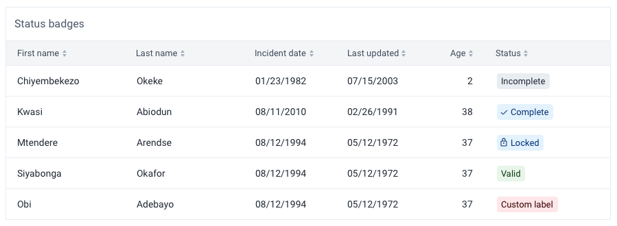

It is often useful to display the status of an item in a data table. Statuses allow easy comparison between rows of data and can highlight important or notable data items.

Use the [tag](../atoms/tag.md) component to display status in data tables. Be sure to follow the usage guidelines for tags.

Only display status when it is relevant to the user. Do not display the status unless multiple statuses are available. For example, do not display statuses if the only status available is 'Active'.

---

### Large cells

Large cells use a larger font-size and cell height. Use large cells where users will rarely see large amounts of data, or where users may be intimidated by compact data.

---

### Combining options

Combining the options listed above allows for flexible, powerful data tables. However, there are some combinations of options that may create confusing or difficult to use interfaces. Try to keep data tables focused on the relevant task. Consider the following guidelines:

-   Avoid using `expandable` and `reordering` together. The drag and drop interaction relies on static heights, and expandable rows allow for dynamic heights which blur the drag and drop interaction.
-   Avoid using `expandable` and `bordered` together. The cell borders will confuse the relationship between the table row and it's expanded content.

For all data tables, only include options that address a user need. Using unnecessary table options will create confusing interfaces.

## States

### Empty state

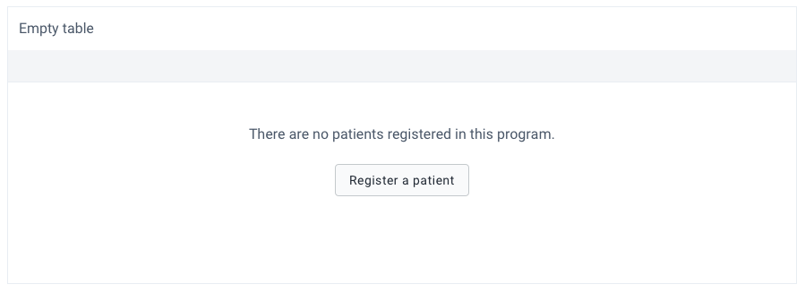

An empty data table should be communicating helpful information to a user. If there is no data to display do not simply show an empty table. Sometimes it may make sense to hide an empty table, but keep in mind that users will be unaware of why the table is hidden and may be confused. In most situations, it is best to show a data table with a useful empty state.

The empty state is flexible and accepts any elements, but by default, it is recommended to present some informative text and an optional action. Without an action, it can be difficult for the user to fix the cause of the empty data. For example, if there are no patients registered in a program, the data table is empty, the action could be 'Register a patient'.

Column headers can be displayed in an empty state if they are available, this can help the user to understand the data that would be there if the table was not empty.

---

## Examples in use

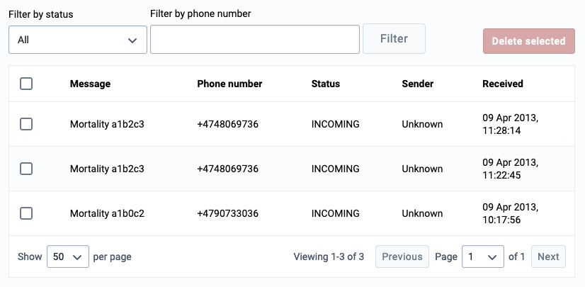

_A list of technical data is displayed as a data table in the SMS configuration app. There might be many rows of this data, so a data table is used to display it in a way that a user can filter and scan the data._
