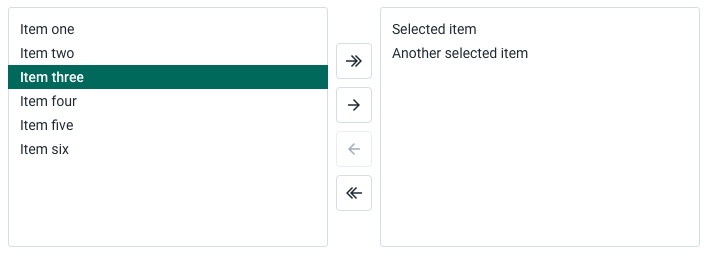
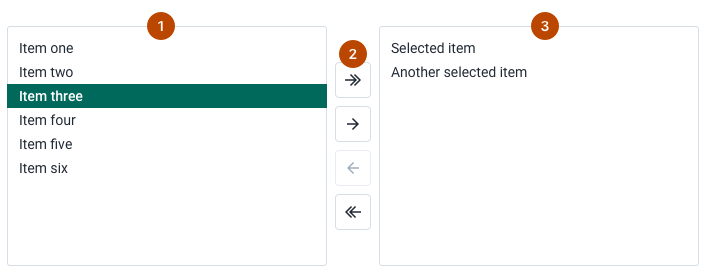
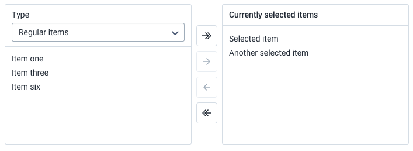
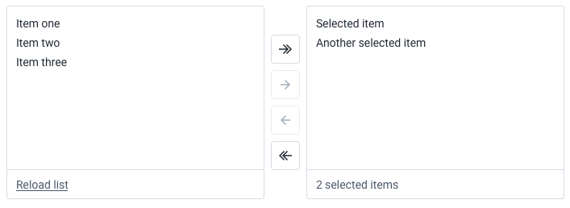
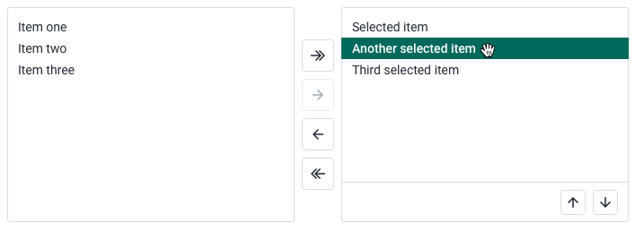
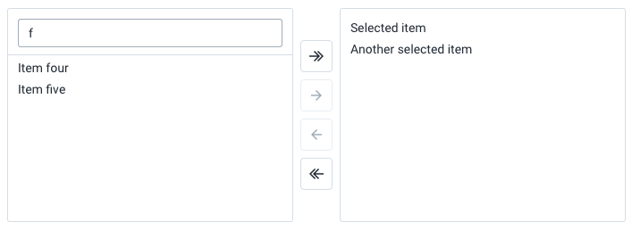
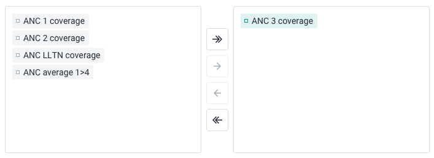
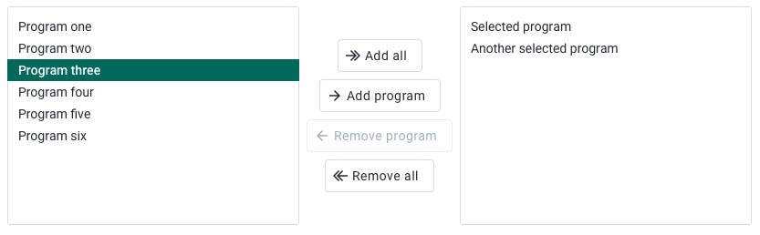
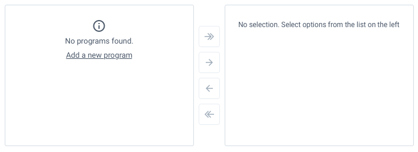
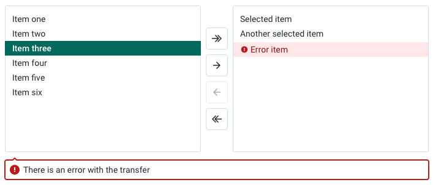

|                      |                                                                                                               |
| -------------------- | ------------------------------------------------------------------------------------------------------------- |
| **Component**        | Transfer                                                                                                      |
| **Type**             | Organism ([?](http://atomicdesign.bradfrost.com/chapter-2/))                                                  |
| **Design Spec**      | [Pixel spec](https://sketch.cloud/s/DwkDk/a/jvobL7), [HTML&CSS spec](https://codesandbox.io/s/transfer-t9ybu) |
| **Working Examples** | [Link](https://ui.dhis2.nu/demo/?path=/story/forms-transfer--single-selection)                                |
| **Status**           | `Ready to use`                                                                                                |

---

# Transfer

The transfer component allows users to select options from a list.

##### Contents

-   [Usage](#usage)
-   [Composition](#composition)
-   [Options](#options)
-   [Types](#types)
-   [States](#states)
-   [Examples in use](#examples-in-use)

---

## Usage

Use a transfer component wherever a user needs to make a complex selection. Simple selections can be achieved with [checkboxes](../atoms/checkbox.md), [radio buttons](../atoms/radio.md) or a [select](../molecules/select.md).

There are use-cases that are particularly suitable for a transfer component:

-   when a user needs to select some options from several different groups at the same time
-   if the selection needs to have a defined order
-   when the user will be interacting with and editing the selection often
-   if a user needs to easily compare non-selected and selected options
-   if a user is making selections as part of a complex flow, especially where there are many options to choose from

### Basic functionality

The basic transfer feature set. The available options are displayed in a list on the left. The selected options are displayed in a list on the right. The transfer controls have buttons for moving one or all of the options to and from each list. Options can also be double clicked to move them back/forth between the lists.

Use a basic transfer if no more additional functionality, detailed below in [options](#options), is required. If the simplest component works for the use case, use the simplest component.

---

## Composition

A transfer is made up of three parts, all of which are required:

1. **Options list, required:** displays the available options the user can select from
2. **Transfer controls, required:** provides controls for the user to transfer options to and from each list
3. **Selection list, required:** displays the selected options

---

## Options

### Headers

The options list and the selection list can display header areas. Header areas accept any type of content, and are often used for selecting groups or types that change the displayed options below. The header can also be used to display a title to give the options context.

Use a header if the options displayed in the list require additional information or controls. Information and controls in the header areas must be directly related to the list. Do not put irrelevant controls in the header areas.

### Footers

Both lists can display footers. Footers are useful for displaying supplementary information or controls.

Use a footer when the information or controls are not important enough to be displayed at the top of the list in a header, but still warrant being included. Because footers are displayed at the bottom their contents will be secondary to the list, so make sure very important actions or information are not shown here.

### Reordering

Reordering allows the user to change the order of the selected options. The user can drag and drop the options into an order, or click to select an option and use the arrow controls in the footer.

Use reordering wherever the order of the selected options is important or meaningful in any way.

### Filtering

Filtering allows the user to filter the options displayed in a list. It is most often used to filter the list of available options, although it is valid to use a filter on the selection list too. The filter is always the last item in the header.

Use filtering if there are many options in the list, or if the options are complex.

### Custom list options

Although by default the options displayed in the list are displayed as text strings, options can be customized to be displayed in any way. Custom options must have idle, selected, hover and active states.

Use custom list options only when it is meaningful to do so. Icons can help a user to understand the available options, for example. Do not use custom list options for purely aesthetic changes.

### Custom button text

The transfer buttons text can be customized.

Use custom button text where a user needs more guidance to use the transfer control. In most cases the arrow buttons are intuitive to use, but text can be added if the use case is for users with low tech literacy.

---

## States

### Empty

An empty state can be defined for each of the two list areas.

The empty state for the available options list should inform the user why there are no options and, where possible, give them an action to fix the problem.

The selection list empty state informs the user that they have not yet selected any options.

Both empty states can be customized. The available options empty state is more useful to the user, so focus efforts on making this an informative and useful empty message.

### Error

Transfers display both a general error indicator, displayed below the transfer, and item specific error icons. The general error indicator always displays when there is a problem with the transfer. Item specific errors are optional, but can be useful to help guide users to fix item specific problems.

Make sure to write clear, concise and actionable error messages. Check out the [Content and communication](../principles/content-communication.md) principle to learn more.

---

## Examples in use

 -->

_A transfer helps make complex data selection simpler in Data Visualizer. In this example the user could select from many different types of option, so additional filter controls are used in the header of the options list. Custom items are used to match the usage in the rest of the app._
