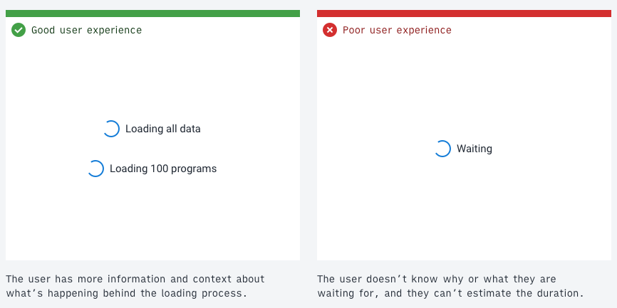
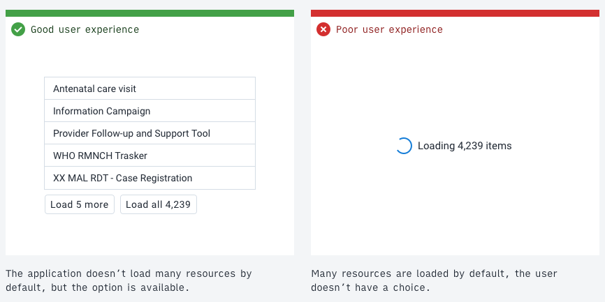
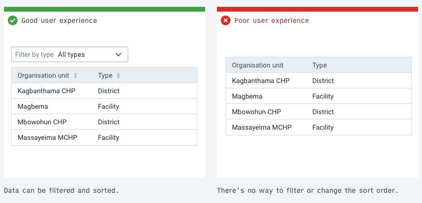
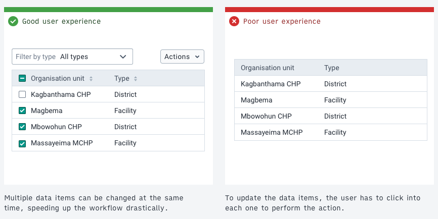
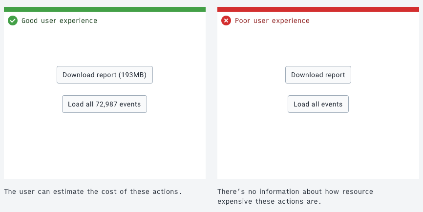

# Designing user experiences for working with large amounts of data

DHIS2 instances often contain large amounts of data and all DHIS2 applications should allow the user to work effectively with these large data sets. Consider the following user interface guidelines when designing and building. Note that these guidelines don't offer technical guidance for handling large amounts of data, check out the DHIS2 developer portal for more information.

## 1. Offer useful information and feedback

Keeping the user informed about what's going on behind the scenes in an application is a key part of a positive user experience. If a user knows that the application is loading many data items, they can guess the amount of time this will take. Useful information and feedback are particularly important when working with large amounts of data because the cost, both real and perceived, of loading the data is high. It would be a frustrating experience to wait several minutes for a page to load, only to find out an error had occurred. Always keeping the user informed avoids this frustration.
Learn more about keeping the user informed from the [key principle of the DHIS2 design system](https://github.com/dhis2/design-system/blob/master/principles/content-communication.md#keeping-the-user-informed).

## 2. Respect user resources

As stated above, it's important to keep users informed about delays. However, where possible, avoid these delays by loading the minimal amount of data that's useful. This approach respects a user's resources and creates a faster workflow.

Consider questions like _do all the data items need to be downloaded right away_? Splitting the data into pages (pagination) and only displaying the first page will often be enough for most use cases. Always make sure to give an option to load all the data for those users who need it. Sometimes downloading all the data may be the default use case and so could be automatic.
Respecting user resources might look like the following:

-   loading the minimum amount of data that's useful upfront
-   giving the user fair warning when an expensive operation will be triggered by an action
-   conservatively using features like type-ahead search that may give a poor experience on limited network connections
-   giving the user controls to manage their local storage
-   gracefully degrading the application and features when resources aren't available

## 3. Filtering, searching and sorting

Paging through data records is inefficient and frustrating. With a limited network connection, the experience becomes unusable. Offer useful filtering and sorting controls to help the user find what they're looking for in large amounts of data.

Study the data to identify useful values for filtering. A value that's the same across all items isn't a useful filter. A value that splits the data into groups is handy and should be exposed as a filter. The right filters for the data depend on the use case. All applications dealing with a lot of data need to have some methods of filtering, searching and sorting data.

## 4. Allow batch editing

Batch editing, editing several data items in a single action, can speed up workflows that might otherwise take many hours into a single action. Consider the use case of removing several hundred records from a data set. If a user has to navigate to each record to delete it then this task will inevitably take a long time. It's more effective if a user can filter for, select and then perform a batch `Delete` operation on the items.

## 5. Confirm expensive operations

A user using a metered network needs to protect their bandwidth, otherwise they may face high costs. In this case, it helps to give the user extra information about the potential costs. This doesn't require distracting popups, subtle cues and feedback can be enough to help the user understand the cost-related consequences.

Costs can be monetary, like a metered network data plan, or practical, like server CPU. Always make sure the benefits of application features are worth their costs.

Consider an application action that would download all 100,000 data items. A button labeled "Download all" is descriptive, but it doesn't give any extra information. A button labeled "Download all 100,000 units" gives an extra cue that helps a user understand the cost-related consequences. A user on a metered data connection can now evaluate if the action is worth the cost. As always, keep the user informed.

The amount of detail and information that should be provided is informed by the use cases and user stories. For example, an application for clinics or health centers that often have data connection issues should display more information, confirmations and warnings about high network usage. On the other hand, an application for data processing that would be used by organizations with stronger networks might need less information.

## 6. Remember the state

Remembering an application state, or storing and caching downloaded data, means users can work faster and with lower costs. For example, a user might download a lot of data, filter that data, then navigate into a single data item. If the user then navigates back to the list of data, it would be inefficient if they had to download the data and set up their filters again.

As much as possible, keep data and states available so that a user can work seamlessly between different levels of detail. This approach makes sense when a user is working in a certain _mode_, working with related data and systems. Not all data or states can or should be persisted. When switching the working _mode_, it can be logical to discard the state or data to avoid unneeded storage and resource issues. If a user has spent time and effort creating an application setup or state, it can be helpful to confirm any action that will discard this work.

## Combining the guidelines: An example

Consider the following example that employs several of the guidelines:

The example application allows management and manipulation of stored data items, perhaps medication commodities. In this example, there are over 700,000 records stored in the database. A user needs to achieve the following:

_"All the items with value 'Storage method' is 'Freezer' need to be updated to change the value 'Location' to 'Warehouse'. I need to update all the items."_

1. First, when the user loads the application, all the 700,000 records shouldn't be loaded automatically. Instead, only the first 50 records are loaded to allow the user to see and analyze the data and values available. (_Respect user resources_)
2. The user filters by a value to find the items they're looking for. They add a filter of "all items where _Storage method_ is _Freezer_". (_Filtering, searching and sorting_) The user clicks a button to apply the filter and load the filter results. No data is transferred until the action is ready to be carried out (_Respect user resources_)
3. The user now has access to all the data items that match their filter, perhaps there are over 100 returned by the filter. Batch editing is useful here. Instead of clicking into each record and updating its value, an action of "Select all results" is available. With the 100+ items selected, the user can perform another action", "Update value…", they choose _Location_ and input the new value, _Warehouse_. A confirmation button uses a label that signals what will happen: "Update Location for 115 units". At each stage of the process, the user is aware of the consequences and costs. (_Offer useful information and feedback_, _Allow batch editing_, _Confirm expensive operations_).
4. While carrying out this task, imagine the user clicks an item without meaning to, which navigates to a different page. The user clicks 'back' in the browser. The filtered state and the loaded results are persisted, the user doesn't need to set up the filters again and make another request. (_Remember the state_).

---

The above guidelines can and should be applied together to create powerful applications with a positive user experience. The intention of the guidelines isn't to restrict applications, but rather to respect a user's experience and resources. All applications need to find the balance that works for their use cases.
