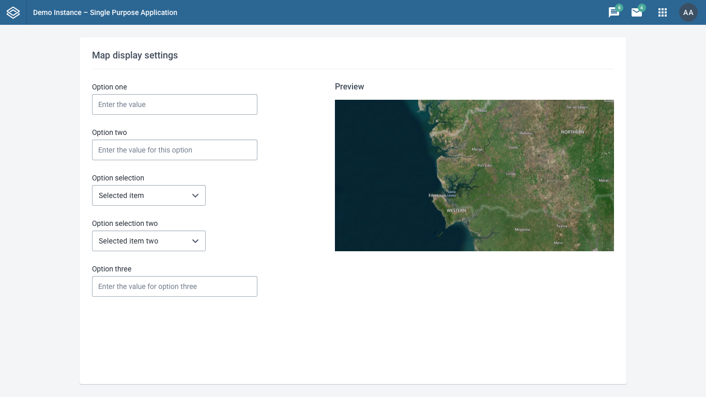
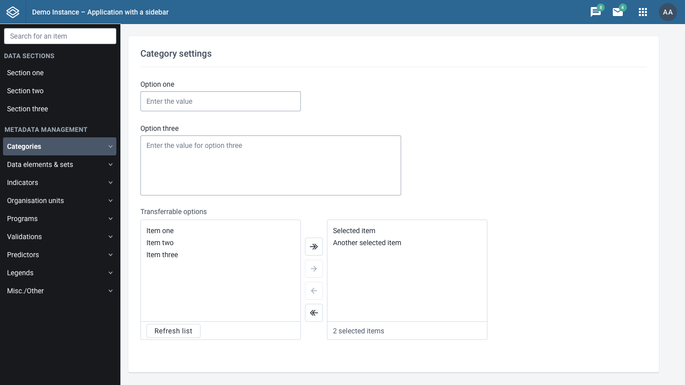
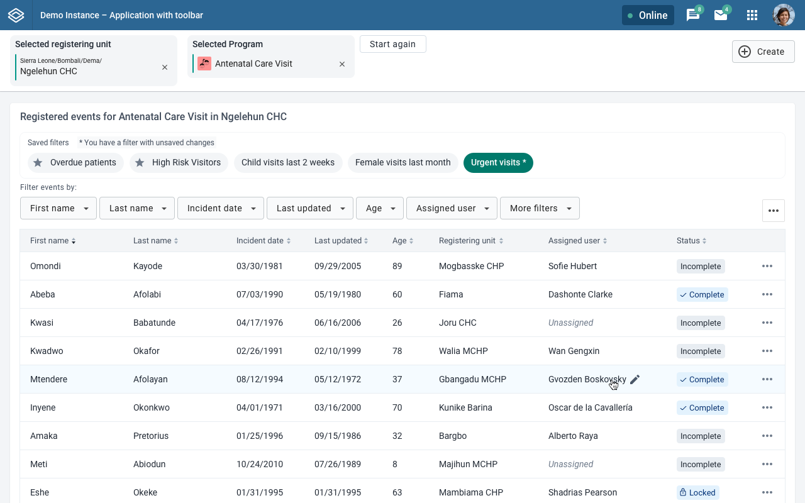
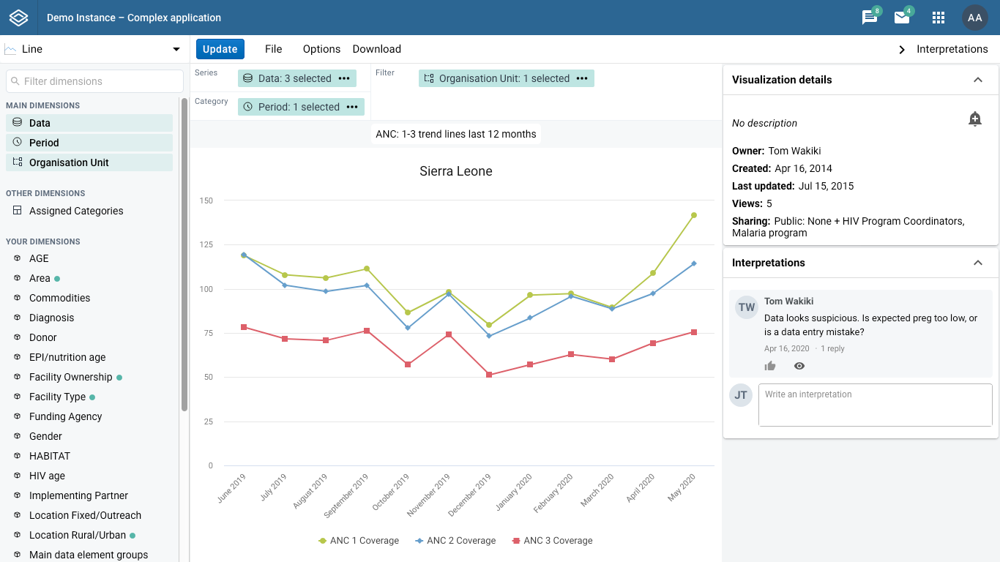
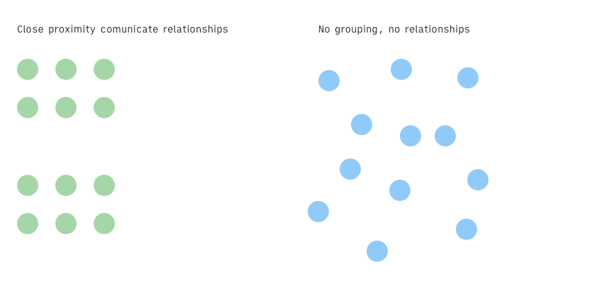
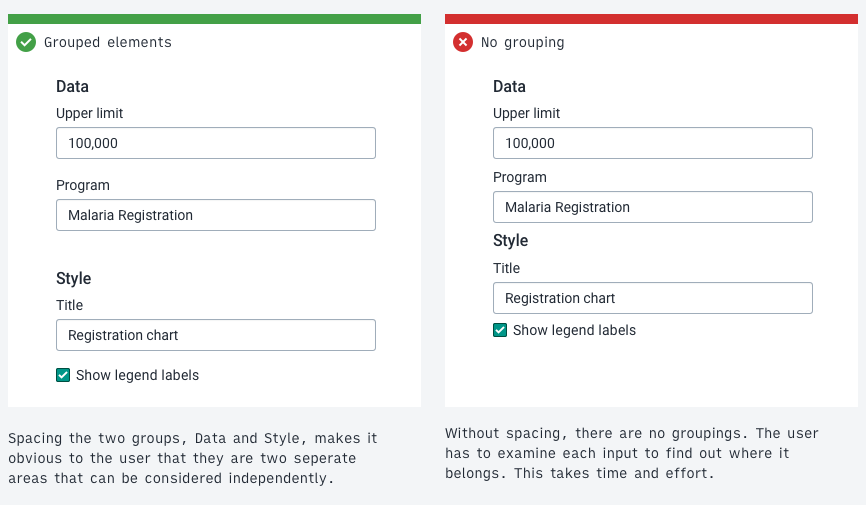
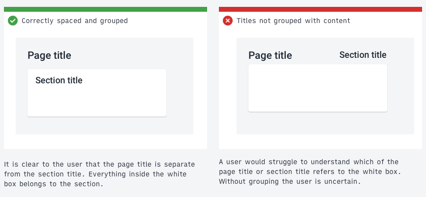
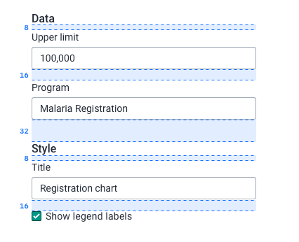
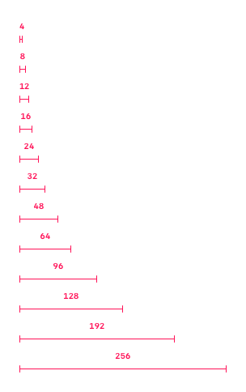
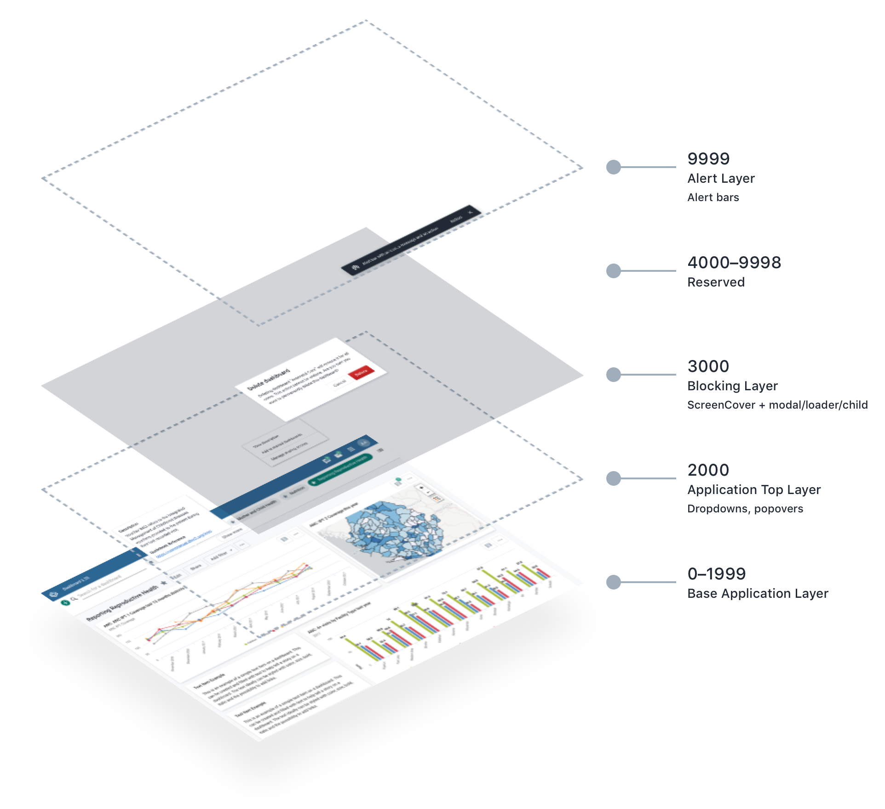

# Layout, spacing, stacking

A visual architecture of an application is made up of layout, spacing and stacking. The visual architecture of DHIS2 applications should follow some basic rules to provide a consistent user experience across different types of apps.

##### Contents

-   [Layout](#layout)
-   [Spacing](#spacing)
-   [Stacking](#stacking)

## Layout

Consistent layouts of applications means users only need to learn a few different patterns to understand many different applications. It is important that DHIS2 applications approach layout consistently.

Not all applications need to look the same, but there should be common elements when dealing with similar tasks. If an application has separate sections it should have a sidebar to move between them. An single-task application should not use a sidebar unnecessarily. The header bar is always placed at the top of the screen. These consistent layout principles help users understand DHIS2 applications.

### Choosing the right layout

An application layout should match it's purpose. The layout should support the user in achieving their goals. An application that is not using an appropriate layout will constantly get in the way of a user. The right layout will step back and let the user work quickly and efficiently.

Knowing which layout to use means understanding the goals of the user. Finding and understanding the purpose of an application is covered in the [Design For Use](design-for-use.md) section.

### Example layouts

It is not possible to define strict rules for when to use different layout types. There are, however, some guidelines that can be followed as a starting point:

#### Single-purpose applications

If an application serves a single purpose it should have a simple, focused layout. The main content comes first so the user can get on with their task.

The example above uses a single column to display the content, in this case some options. There is no need for a secondary navigation or toolbar in this case.

Only use this type of layout when an application has a single purpose. If an application with different sections used this layout it would be very difficult for the user to explore and navigate the different areas.

#### Applications with secondary navigation

An application with different sections needs a clear way to navigate between those sections. Most often a sidebar will work well for this purpose. A sidebar can be collapsed when a user doesn't need to use it.

The example above uses a left-aligned sidebar to provide navigation for the different sections of the application. Each section has it's own content. The user can clearly understand where they are in the application. The titles of each section in the sidebar navigation help the user understand what tasks can be achieved there.

Sidebar navigation can display multiple sub-levels of navigation to help the user navigate complex structures. Make sure the titles of each sections are easy to understand. A user should not have to click inside a section to find out what it does.

#### Toolbar vs. Navigation

Sometime applications do not have separate sections to navigate between, but they do need to provide tools or options on all screens. A toolbar can work here. A toolbar, aligned to the top of the screen (under the header bar), provides quick access at all times.

The example layout above demonstrates a toolbar with some global options. The content below the toolbar changes and can respond to actions taken in the toolbar.

A toolbar is more suited to this case than a sidebar. A sidebar takes up a lot of screen space and should be used where the sidebar content is consistently useful or can be hidden (by collapsing the sidebar). A toolbar takes less screen space and should not be hidden.

#### Complexity

Complex applications can make use of multiple different layout elements. Secondary navigation inside a sidebar, quick options in a toolbar, a third sidebar with auxiliary content to support the main content. Panels that open at the bottom of the screen can provide extra content to a user and be hidden when they are not needed. The example above, Data Visualizer, uses a left sidebar, right sidebar and multiple toolbars to provide the right functionality when the user needs it.

The most important guideline to keep in mind: the layout should match the purpose of the application.

### Layouts on all screens

An application should work on many different screen sizes. Some users have very wide screens, some have narrow screens. Make sure your application works on the screen that your users use the most. (Most laptops produced today have a 1366 x 768 resolution, for example. This can change between regions.) Do not rely on users having a wide screen to use an application efficiently.

When appropriate, take advantage of users using wide screens to provide them with extra functionality without scrolling.

---

## Spacing

Spacing of page elements is important. The space between and around elements tells the user about the relationship of those elements. Where elements are placed on a page and how they are spaced should be carefully considered. Remember that a user will infer and understand an application from these visual cues, so it is important to consider it thoroughly.

### Grouping

One of the most important examples of communicating with space is grouping elements. Following [the laws of proximity](https://en.wikipedia.org/wiki/Principles_of_grouping), the relationship of elements can be understood by their proximity to one another.

For a DHIS2 application, that means placing related elements in proper proximity helps to communicate their relationships to one another. Related settings or options should be grouped together, rather than spaced out evenly.

A user looking at the interface in the example above doesn't see any relationships without proper spacing. They have to read each item to understand how it relates to another. The example with spacing that reflects the relationship between items helps the user build a mental model of the structure and work more efficiently.

#### Example: titles

Another example of proximity spacing and grouping is page and section titles. A user can often be confused by which title applies to which content.

Page titles should have enough spacing to help the user understand that they are not part of the page content itself. Section titles should be place close to the section content.

Consider the following example of a page and section title:

The incorrect example on the right is difficult to understand at a glance. Which title applies to the page and which to the content? They are all in similar proximity to one another. The correct example on the left makes it clear that the page title is separate from the content displayed on the page. The section title is grouped together with it's content. Without even reading the words a user can understand the underlying structure.

### The spacing scale and 8-point-grid

Working on an [8 point grid](https://spec.fm/specifics/8-pt-grid) helps to keep spacing and layout consistent throughout an application. In the example above each element is spaced according to the 8 point grid - 8, 16, 32 and so on. [Learn more about the 8 point grid here](https://spec.fm/specifics/8-pt-grid). The DHIS2 Design System also defines a spacing scale of values based on this grid that fit most situations. Instead of deciding between single pixel values, use values from the spacing scale. Consistent use of the spacing system creates vertical rhythm on a screen. The spacing scale is available as part of the [DHIS2 ui library](https://ui.dhis2.nu/#/api) as ready-to-use 'spacers'.

### Information dense layouts

Some applications should be compact and information dense, some applications should have generous spacing. Like a layout, the amount of spacing generally used in an application depends on it's purpose.

As a guideline, applications to be used by high-tech-literate users can afford to be more compact and information dense. Applications aimed at low-tech-literate users should have more space between elements to help users navigate and work effectively. High-tech-literate users are generally more comfortable with dense layouts.

Consider how much content or controls should be placed on a single page. Low-tech-literate users might benefit from an application that presents a low number of simple options split over several pages. Advanced users may prefer to have all of these options available on a single page. The right amount of spacing depends on the users that will be using the application.

---

## Stacking

_Stacking_ refers to the concept of layering interface elements on top of one another. A modal dialog _stacks_ on top of the main application view. It is important to maintain a consistent approach to the stacking of elements throughout an application.

The higher the layer in the stacking the more important it will be understood to be. Alerts and critical messages appear on the highest layer because they are the most important information on screen.

The consistent usage of stacking creates applications that work in similar ways, meaning they can be understood quickly and easily by users.

The DHIS2 design system defines fives stack layers:

| Layer                           | Description                                                                                                                                                                                                                                                           |
| ------------------------------- | --------------------------------------------------------------------------------------------------------------------------------------------------------------------------------------------------------------------------------------------------------------------- |
| Base Application Layer (0–1999) | Contains all components, controls and data for the main application. The application can define its own layering from 0 to 1999.                                                                                                                                      |
| Application Top Layer (2000)    | Protected components that always layer over the top of the base application layer. This layer is reserved for controls such as dropdowns and popovers that functionally must always display above the application content.                                            |
| Blocking Layer (3000)           | Blocks the application and its controls. Only use for actions that are intentionally interrupting. This layer contains a screen cover that blocks the layers beneath. Child elements, such as [modals](../molecules/modal.md) or loaders, can be added to this layer. |
| Reserved (4000–9998)            | Reserved for future development.                                                                                                                                                                                                                                      |
| Alert Layer (9999)              | The top layer is reserved for displaying [alert bars](../molecules/alertbar.md). Alert bars can contain critical information and so must always be displayed above all other content.                                                                                 |

Note: the stacking system is not a technical implementation of `z-index` values. See the DHIS2 ui library for implementation details.
