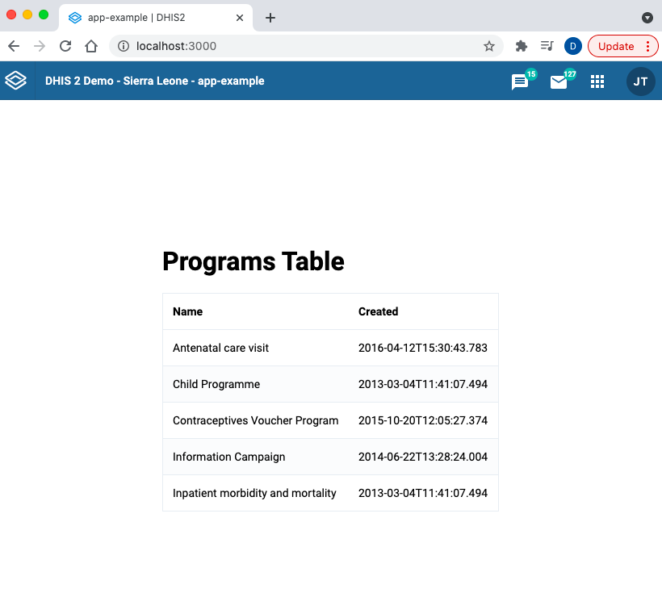

Follow this quick guide to add a `Table` component to your application using the [DHIS2 UI Library](/design-system).

## Prerequisites

This guide assumes that you're developing an application using the [DHIS2 Application Platform](/docs/app-platform/getting-started) and its tools. To know more or get started, please follow this tutorial: [Environment Setup](/docs/tutorials/setup-env).

## 1. Import `Table`

First, let's import the [Table](pathname:///demo/?path=/docs/table--static-layout) component as well as its child components:

```js
import {
    Table,
    TableBody,
    TableCell,
    TableCellHead,
    TableHead,
    TableRow,
    TableRowHead,
} from '@dhis2/ui'
```

## 2. Use components

In this example, we are using the [DHIS2 App Runtime](/docs/app-runtime/hooks/useDataQuery) to fetch and display the `programs` resource from the DHIS2 Web API (as you can see in the `query` object defined in the `src/App.js` file below).

See the highlighted lines of code - this is how we can represent the programs data in a `Table` component:

```jsx {43-60} title="src/App.js"
import { useDataQuery } from '@dhis2/app-runtime'
import React from 'react'
import classes from './App.module.css'
import {
    Table,
    TableBody,
    TableCell,
    TableCellHead,
    TableHead,
    TableRow,
    TableRowHead,
} from '@dhis2/ui'

const query = {
    results: {
        resource: 'programs',
        params: {
            pageSize: 5,
            fields: ['id', 'created', 'displayName'],
        },
    },
}

const MyApp = () => {
    const { loading, error, data } = useDataQuery(query)

    if (error) {
        return <span>ERROR: {error.message}</span>
    }

    if (loading) {
        return <span>Loading...</span>
    }

    return (
        <div className={classes.container}>
            <div>
                <h1>Programs Table</h1>
                <Table>
                    <TableHead>
                        <TableRowHead>
                            <TableCellHead>Name</TableCellHead>
                            <TableCellHead>Created</TableCellHead>
                        </TableRowHead>
                    </TableHead>
                    <TableBody>
                        {data.results.programs.map(
                            ({ id, created, displayName }) => (
                                <TableRow key={id}>
                                    <TableCell>{displayName}</TableCell>
                                    <TableCell>{created}</TableCell>
                                </TableRow>
                            )
                        )}
                    </TableBody>
                </Table>
            </div>
        </div>
    )
}

export default MyApp
```

## 3. Check your browser

In your browser, you should be able to see the following `Table` 👇



### More examples?

Please check the [UI Library documentation](pathname:///demo/?path=/docs//table--static-layout) for more examples and a list of demos as well as **code snippets** that let you easily copy and paste into your application! 👌🏽

---
