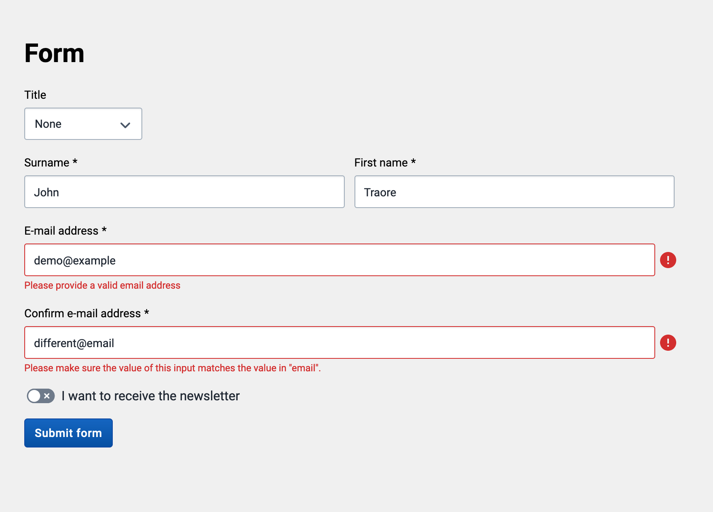

# React Final Form in the UI library

[React Final Form](https://final-form.org/docs/react-final-form/getting-started) is the preferred library for form data handling and validation in DHIS2 apps, and comes with a number of useful features. It is included in and exported from the UI library and can be imported in your project like so:

```js
import { ReactFinalForm } from '@dhis2/ui'

const { Form, Field } = ReactFinalForm
```

A number of form components are available in the UI library for use with Final Form, such as `InputFieldFF`. All the components whose names end with 'FF' are intended for use with Final Form and are wired up to provide validation, state management, and event handling with minimal configuration. See demos of those components for usage examples.

The UI library provides a number of useful **validators** as well for use with final form, which you'll also find a page about in the sidebar.

Here is an example of making a form with React Final Form and DHIS2 UI components: (code below)



```js
import {
    ReactFinalForm,
    InputFieldFF,
    SingleSelectFieldFF,
    SwitchFieldFF,
    composeValidators,
    createEqualTo,
    email,
    hasValue,
    Button,
} from '@dhis2/ui'
import React from 'react'
import styles from './Form.module.css'

const alertValues = values => {
    const formattedValuesString = JSON.stringify(values, null, 2)
    alert(formattedValuesString)
}

export const Form = () => (
    <div className={styles.container}>
        <h1>Form</h1>

        <ReactFinalForm.Form onSubmit={alertValues}>
            {({ handleSubmit }) => (
                <form onSubmit={handleSubmit}>
                    <div className={styles.row}>
                        <ReactFinalForm.Field
                            name="title"
                            label="Title"
                            component={SingleSelectFieldFF}
                            className={styles.title}
                            initialValue="none"
                            options={[
                                { label: 'Professor', value: 'prof' },
                                { label: 'Doctor', value: 'doc' },
                                { label: 'None', value: 'none' },
                            ]}
                        />
                    </div>

                    <div className={styles.row}>
                        <ReactFinalForm.Field
                            required
                            name="surname"
                            label="Surname"
                            component={InputFieldFF}
                            className={styles.surname}
                            validate={hasValue}
                        />

                        <ReactFinalForm.Field
                            required
                            name="firstname"
                            label="First name"
                            component={InputFieldFF}
                            className={styles.firstname}
                            validate={hasValue}
                        />
                    </div>

                    <div className={styles.row}>
                        <ReactFinalForm.Field
                            required
                            name="email"
                            label="E-mail address"
                            component={InputFieldFF}
                            className={styles.email}
                            validate={composeValidators(email, hasValue)}
                        />
                    </div>

                    <div className={styles.row}>
                        <ReactFinalForm.Field
                            required
                            name="email-confirmation"
                            label="Confirm e-mail address"
                            component={InputFieldFF}
                            className={styles.email}
                            validate={composeValidators(
                                createEqualTo('email'),
                                hasValue
                            )}
                        />
                    </div>

                    <div className={styles.row}>
                        <ReactFinalForm.Field
                            type="checkbox"
                            name="newsletter"
                            label="I want to receive the newsletter"
                            component={SwitchFieldFF}
                            className={styles.newsletters}
                            initialValue={false}
                        />
                    </div>

                    <div className={styles.row}>
                        <Button type="submit" primary>
                            Submit form
                        </Button>
                    </div>
                </form>
            )}
        </ReactFinalForm.Form>
    </div>
)
```
