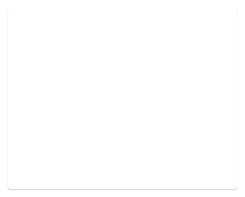
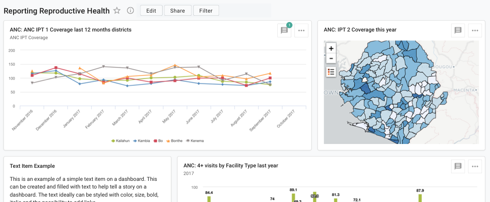
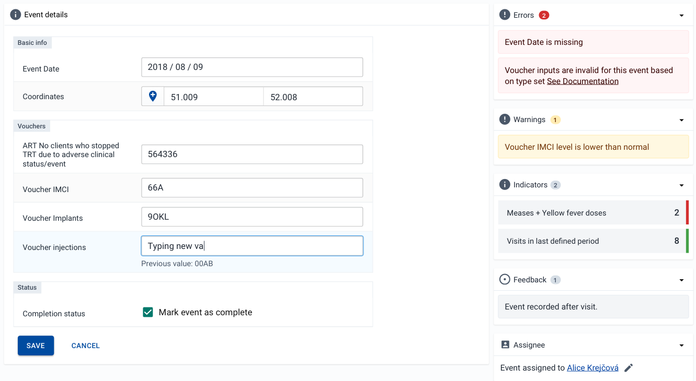

|                      |                                                                    |
| -------------------- | ------------------------------------------------------------------ |
| **Component**        | Card                                                               |
| **Type**             | Atom ([?](http://atomicdesign.bradfrost.com/chapter-2/))           |
| **Design Spec**      | _pending_                                                          |
| **Working Examples** | [Link](https://ui.dhis2.nu/demo/?path=/story/layout-card--default) |
| **Status**           | `Ready to use`                                                     |

---

# Card

A card is a container element for grouping together and separating blocks of content.

##### Contents

-   [Usage](#usage)
-   [Examples in use](#examples-in-use)

---

## Usage

Use a card where there is content that can be grouped together. Cards are most often useful when this grouped content may be repeated, for example with items on a dashboard, or different sections of patient information displayed in a profile.

---

## Examples in use

_Dashboard items are displayed inside cards, highlighting the fact they are self-contained blocks of information_

---

_Different sections of information, all relating to the same event, are displayed in their own cards_
