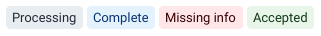
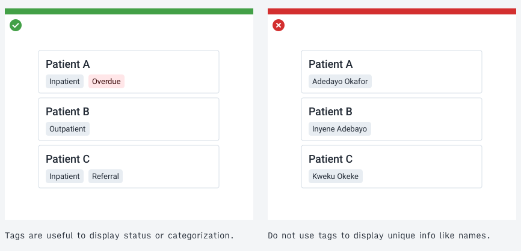
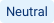
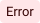
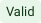
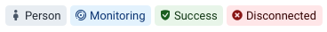
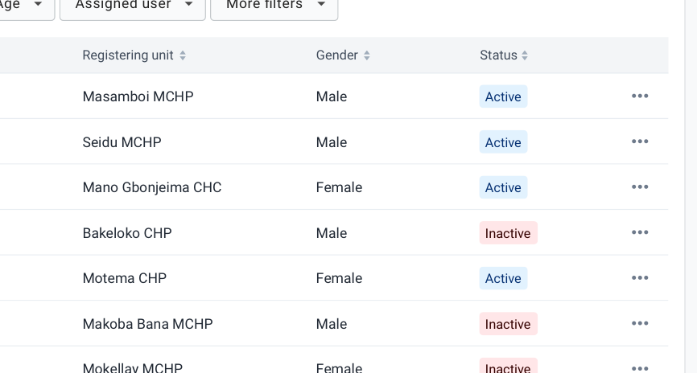

|                      |                                                                         |
| -------------------- | ----------------------------------------------------------------------- |
| **Component**        | Tag                                                                     |
| **Type**             | Atom ([?](http://atomicdesign.bradfrost.com/chapter-2/))                |
| **Design Spec**      | [CSS Spec](https://sleepy-yalow-3c0c76.netlify.com/)                    |
| **Working Examples** | [Link](https://ui.dhis2.nu/demo/?path=/story/data-display-tag--default) |
| **Status**           | `Ready to use`                                                          |

---

# Tag

A tag is used to display categorizing labels or information for other elements in a collection.

##### Contents

-   [Usage](#usage)
-   [Options](#options)
-   [Examples in use](#examples-in-use)

---

## Usage

Tags are used whenever an element in a collection needs to display its category or status. Tags should not be used for one-off, unique information. Tags can be displayed in any kind of component.

Tags are useful when displaying multiple elements in a collection that have the same basic attributes but belong to different categories or have different statuses. Do not use tags for elements that will always be the same, instead use a heading or other grouping method.

Tags are never used for primary interaction and should not be used as buttons. Clicking a tag could sort a collection by that tag, or open a page to display all elements that have that tag type. Tags should not be used as navigation elements.

---

## Options

### Color

Tags are available in four different colors. The color of a tag depends on its content and the meaning of that tag. The following system is used for tag coloring:

| Tag                              | Meaning                                                                                     |
| -------------------------------- | ------------------------------------------------------------------------------------------- |
|   | Default. The grey tag is default and has its color should not imply meaning.                |
|   | Neutral. Blue is used when a tag could have valid or error status but is currently neutral. |
|    | Error. Red tags imply an error or a problem.                                                |
|  | Valid. Green tags should be used to indicate validity or success.                           |

### Icon

Tags can contain icons. Use icons where they will help users easily identify the content of the tag. Tags must have a text label and cannot display only an icon.

### Bold

Tags have an optional `bold` property. Use bold tags where it is important that the tag is seen by the user in an information dense interface. Bold tags should be reserved for edge cases and not overused.

---

## Examples in use

_Tags are used to give an overview of the status of all the patients displayed in a list in Capture app._
