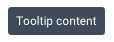
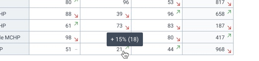
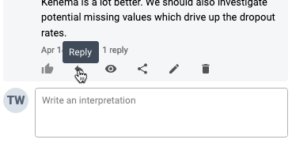
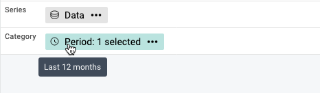

|                      |                                                                                           |
| -------------------- | ----------------------------------------------------------------------------------------- |
| **Component**        | Tooltip                                                                                   |
| **Type**             | Atom ([?](http://atomicdesign.bradfrost.com/chapter-2/))                                  |
| **Design Spec**      | [Link](https://sketch.cloud/s/DwkDk/a/zY21gy)                                             |
| **Working Examples** | [Link](https://ui.dhis2.nu/demo/?path=/story/data-display-tooltip--default-placement-top) |
| **Status**           | `Ready to use`                                                                            |

---

# Tooltip

A tooltip is a container for displaying information about an element, it is displayed when a user hovers over the element.

##### Contents

-   [Usage](#usage)
-   [Options](#options)
-   [Examples in use](#examples-in-use)

---

## Usage

Tooltips only display when a user hovers over an element. Do not use tooltips for critical or important information, users may not find the information or it may completely unavailable to mobile users. Information provided in tooltips should be supplementary or provide helpful context. Icon buttons can use tooltips to inform the user of their action. Never put important information or actions inside a tooltip.

-   Common usage of a tooltip is to expand on the displayed information when the user hovers over the element.
-   Do not place actions inside a tooltip, they would be hidden from the user and difficult to click.
-   Only text can be displayed in a tooltip. A [popover](../molecules/popover.md) can be used for rich information.
-   Limit the text inside a tooltip to a single, short sentence.
-   Do not repeat information in a tooltip, provide extra relevant, useful information.

---

## Options

### Placement

By default the tooltip should display above the hovered element. Alternatively, a tooltip may be displayed underneath or to the side of an element if there is limited space.

### Delay

Tooltips allow customization of two delay durations:

1. `Open`: the delay between the user hovering or focusing the trigger element and the tooltip displaying
2. `Close`: the delay between the user hover or focus leaving the trigger element and the tooltip hiding

The default delay values cover generic tooltip use cases. Use the default values unless there is a specific reason, backed by a use case, not to. Where a custom duration is used, consider the following guidelines:

-   the default `open` and `close` delay are suited to tooltips that provide guidance and hints for all users
-   a longer `open` delay may be suitable if a tooltip is used to expose more details about an element for advanced users.
-   a shorter `close` delay might be suitable if there are many tooltip triggers in a single interface, for example, a list where every element triggers a tooltip.

---

## Examples in use

_This tooltip gives the user some more context for the upwards arrow inside the cell: the percentage positive growth and the previous value._

---

_This tooltip gives extra information for new users about the action attributed to this icon used in an information dense environment._

---

_Hovering over the selected period elements displays extra information, which period is selected. The tooltip is positioned down to avoid overlapping the information above._
