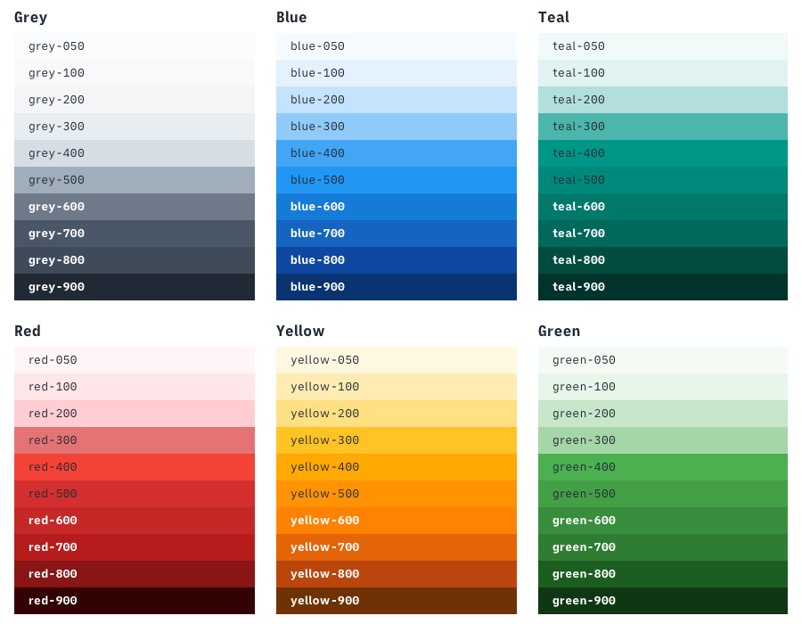
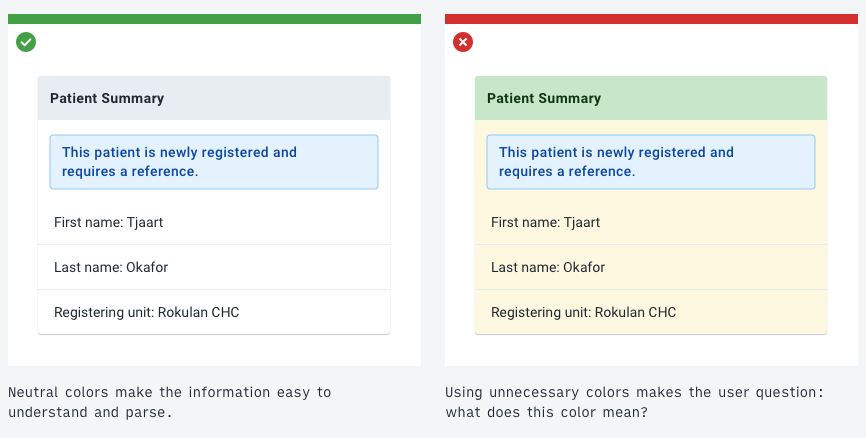
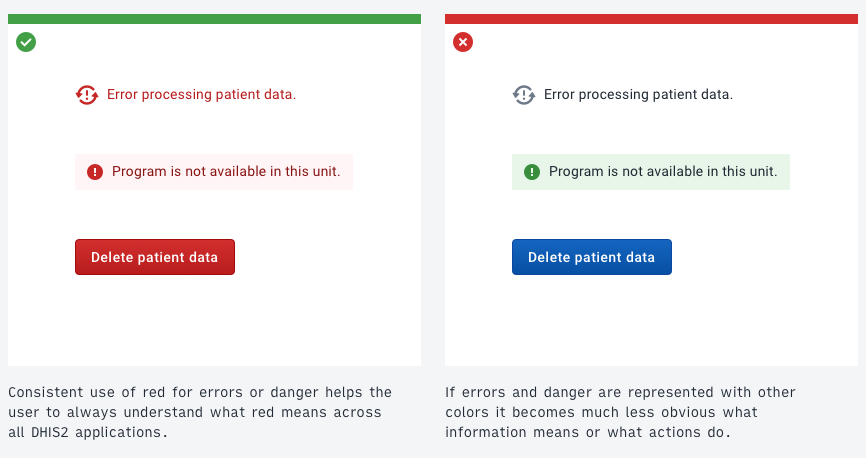
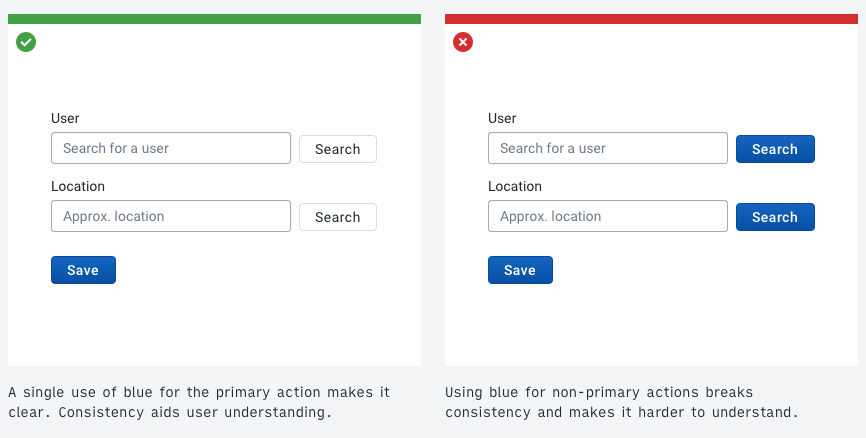
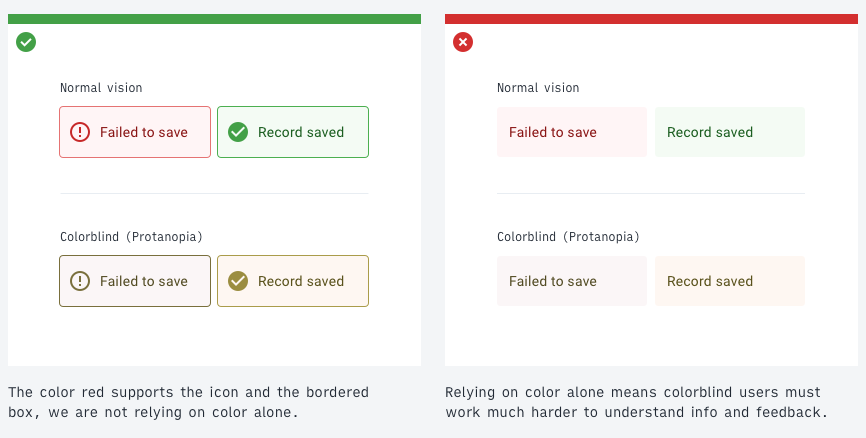
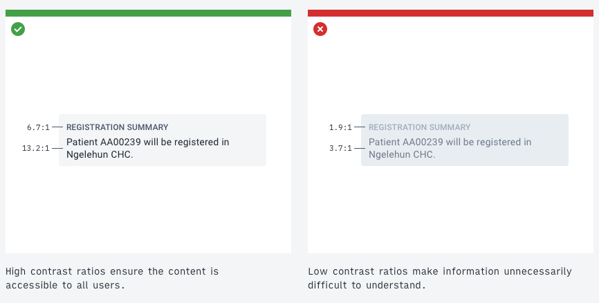

# Color

Color is used in DHIS2 to support effective communication. DHIS2 applications use color to help the user understand information, feedback and more. The colors used in an application should not be chosen based primarily on how they look, but how they convey information and aid understanding.

It is important to maintain consistent usage of colors throughout the DHIS2 platform. Globally, color meanings are relative. It is not possible to say "red = danger". However, using a consistent color palette we can establish that "red **in DHIS2** = danger".

Color alone should not be relied upon to communicate effectively. Read more about [color accessibility](#accessibility).

## DHIS2 Color Scale

The DHIS2 color scale contains 7 colors. Each color has 10 shades. This color system provides enough colors for all situations.

Reference: [Color codes and #hex values for the DHIS2 color scale](#color-scale-reference).

## General, simplified principles

Each color in the DHIS2 color scale has a purpose. Put simply:

-   **Grey**: general interface elements, neutral information
-   **Blue**: important neutral information, primary actions
-   **Teal**: selected or active elements
-   **Red**: danger, error, destructive action
-   **Yellow**: warning, non-blocking error
-   **Green**: positive feedback, valid, success

Generally speaking, for all colors, the values also have a purpose:

-   **900–700**: text, information, active or highlighted content
-   **600–300**: icons, states (inactive, disabled, etc.)
-   **200–050**: backgrounds, tints, accents

## Using color

Color usage in DHIS2 applications should be subtle. Reserve colors for when they need to communicate effectively. For example:

## Accessibility

Do not rely on color alone to communicate. Not everyone sees color the same. Relying on color to communicate will restrict access for partially sighted, color blind and users with low-quality display hardware.

**Always use color with another method, such as text formatting or icon usage, to communicate.**

Relying on color alone to signal an error to a user is problematic. For example:

Pay attention to contrast too. Information dense text needs to satisfy a minimum contrast ratio of 7:1 to be accessible to all users and headers and secondary text should pass a 4.5:1 ratio:

Remember, when dealing with accessibility issues that designs may work or be understandable on your screen, but not necessarily on others. Make sure to think of all kinds of users with all kinds of hardware when designing with accessibility in mind. Use an [WCAG2.0 standard accessibility checker](http://accessible-colors.com/) to check contrast. Aim for AAA rating for all essential interface elements.

A DHIS2 instance can be themed. Adjusting theme colors will overwrite the `blue` and `teal` colors of the scale.

When selecting theme colors, make sure they do not clash with the colors established in the DHIS2 color scale. Using red for the main header bar will confuse: is the header bar in an error state?  -->

## Color Scale Reference

|                                                | Name      | Hex       |
| ---------------------------------------------- | --------- | --------- |
|  | `grey050` | `#FBFCFD` |
|  | `grey100` | `#F8F9FA` |
|  | `grey200` | `#F3F5F7` |
|  | `grey300` | `#E8EDF2` |
|  | `grey400` | `#D5DDE5` |
|  | `grey500` | `#A0ADBA` |
|  | `grey600` | `#6E7A8A` |
|  | `grey700` | `#4A5768` |
|  | `grey800` | `#404B5A` |
|  | `grey900` | `#212934` |

|                                                | Name      | Hex       |
| ---------------------------------------------- | --------- | --------- |
|  | `blue050` | `#f5fbff` |
|  | `blue100` | `#e3f2fd` |
|  | `blue200` | `#c5e3fc` |
|  | `blue300` | `#90caf9` |
|  | `blue400` | `#42a5f5` |
|  | `blue500` | `#2196f3` |
|  | `blue600` | `#147cd7` |
|  | `blue700` | `#1565c0` |
|  | `blue800` | `#0d47a1` |
|  | `blue900` | `#093371` |

|                                                | Name      | Hex       |
| ---------------------------------------------- | --------- | --------- |
|  | `teal050` | `#f1f9f9` |
|  | `teal100` | `#e0f2f1` |
|  | `teal200` | `#b2dfdb` |
|  | `teal300` | `#4db6ac` |
|  | `teal400` | `#009688` |
|  | `teal500` | `#00897b` |
|  | `teal600` | `#00796b` |
|  | `teal700` | `#00695c` |
|  | `teal800` | `#004d40` |
|  | `teal900` | `#00332b` |

|                                              | Name     | Hex       |
| -------------------------------------------- | -------- | --------- |
|  | `red050` | `#fff5f6` |
|  | `red100` | `#ffe5e8` |
|  | `red200` | `#ffcdd2` |
|  | `red300` | `#e57373` |
|  | `red400` | `#f44336` |
|  | `red500` | `#d32f2f` |
|  | `red600` | `#c62828` |
|  | `red700` | `#b71c1c` |
|  | `red800` | `#891515` |
|  | `red900` | `#330202` |

|                                                    | Name        | Hex       |
| -------------------------------------------------- | ----------- | --------- |
|  | `yellow050` | `#fff8e1` |
|  | `yellow100` | `#ffecb3` |
|  | `yellow200` | `#ffe082` |
|  | `yellow300` | `#ffc324` |
|  | `yellow400` | `#ffa902` |
|  | `yellow500` | `#ff9302` |
|  | `yellow600` | `#ff8302` |
|  | `yellow700` | `#e56408` |
|  | `yellow800` | `#bb460d` |
|  | `yellow900` | `#6f3205` |

|                                                  | Name       | Hex       |
| ------------------------------------------------ | ---------- | --------- |
|  | `green050` | `#f4fbf4` |
|  | `green100` | `#e8f5e9` |
|  | `green200` | `#c8e6c9` |
|  | `green300` | `#a5d6a7` |
|  | `green400` | `#4caf50` |
|  | `green500` | `#43a047` |
|  | `green600` | `#388e3c` |
|  | `green700` | `#2e7d32` |
|  | `green800` | `#1b5e20` |
|  | `green900` | `#103713` |

