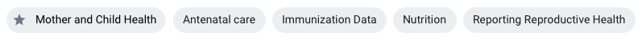
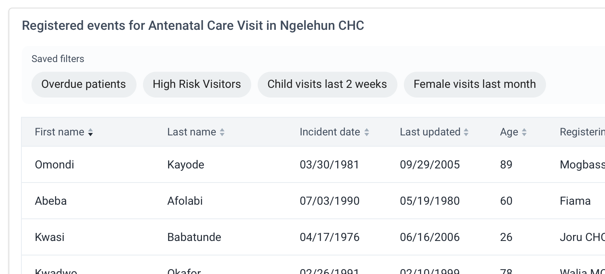
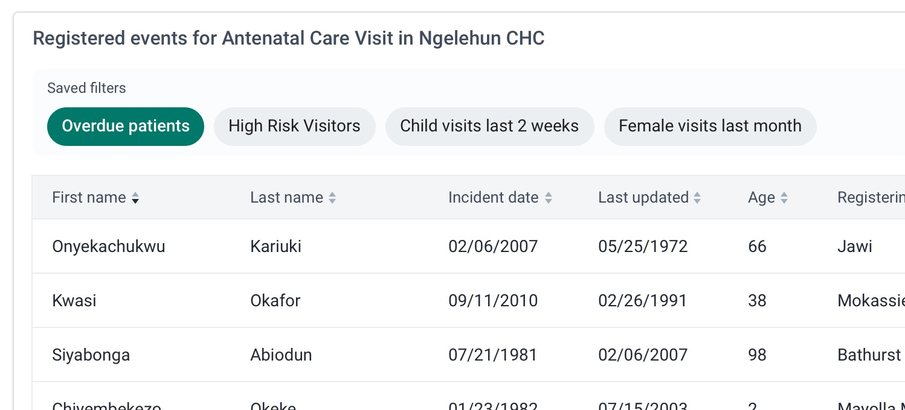
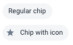
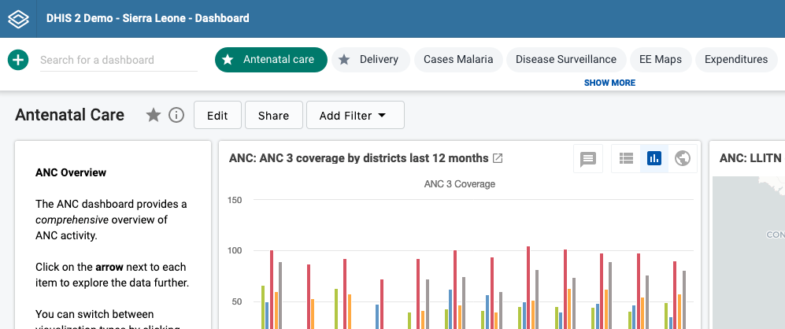

|                      |                                                                     |
| -------------------- | ------------------------------------------------------------------- |
| **Component**        | Chip                                                                |
| **Type**             | Atom ([?](http://atomicdesign.bradfrost.com/chapter-2/))            |
| **Design Spec**      | _pending_                                                           |
| **Working Examples** | [Link](https://ui.dhis2.nu/demo/?path=/story/actions-chip--default) |
| **Status**           | `Ready to use`                                                      |

---

# Chip

Chips are useful for displaying a selection of defined choices and filters to the user.

##### Contents

-   [Usage](#usage)
-   [Options](#options)
-   [Examples in use](#examples-in-use)

---

## Usage

Chips are used to display a list of defined options, filters or views for a related view. Chips are always a secondary content to a main element, for example a data table or a dashboard. A common usage of this that can help to understand the pattern is a table with a set of filters:

_In this example the group of chips above represent 'Saved Filters' for the user to choose from. These filters will apply to the data table below_

The chips displayed above the table act as defined filters for the table. In the example above, selecting "Overdue Patients" chip will select that chip and display only that data in the table below. **To deselect the chip the user can click again, or a 'Clear filters' control could be provided.**

_"Overdue patients" is selected/active, so the data in the table below changes to reflect this. The 'Overdue Patients' chip is displayed in 'Selected' style to highlight this._

### Chip vs. Button

Chips should only be used for filtering or selecting an option. Do not use filters to trigger actions such as 'Save', 'Exit' or 'Open'. Use a [button](button.md) to trigger actions.

### Displaying chips

-   Chips should be displayed in a horizontal list, where space permits.
-   Do not stack single chips on top of one another if there is space to display them inline.
-   Do not use horizontal scrolling to display a large number of chips. Always wrap chips onto a new line below.

---

## Options

### Icon

A chip can display an optional icon. Use icons in chips to highlight special/unique chip items. Do not use the same icon on all chips, otherwise it will be meaningless. To clarify what a group of chips are, use a title or header instead.

### Single vs. Multiple Selections

A group of chips can be set up for single or multiple selection, it depends on the usage. When using chips for selecting the active dashboard it makes sense to only allow a single selection at a time. You may choose to allow the user to select multiple chips, or filters, for a table displaying data.

---

## Examples in use

_A users dashboards are represented by chips. Favorite dashboards use chips with a star icon._
