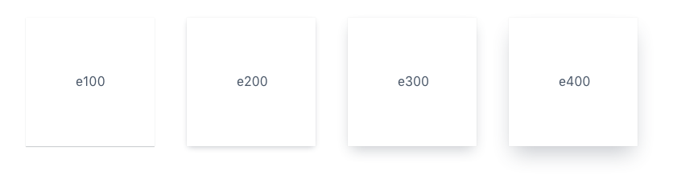
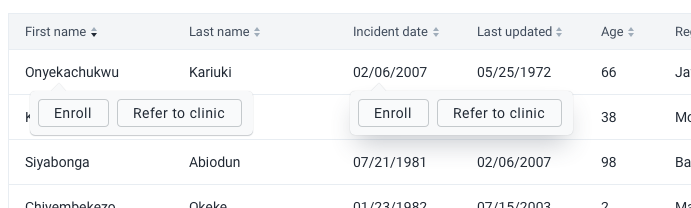

|                      |                                                                                    |
| -------------------- | ---------------------------------------------------------------------------------- |
| **Component**        | Elevation                                                                          |
| **Type**             | Utility ([?](http://atomicdesign.bradfrost.com/chapter-2/))                        |
| **Design Spec**      | [Link](https://codepen.io/j_cpr/pen/oOBLMp)                                        |
| **Working Examples** | [Link](https://ui.dhis2.nu/demo/?path=/story/helpers-css-variables--all-variables) |
| **Status**           | `Ready to use`                                                                     |

---

# Elevation

Elevation is used to create depth in a user interface.

##### Contents

-   [Usage](#usage)
-   [Options](#options)
-   [Examples in use](#examples-in-use)

---

## Usage

Use elevation to separate interface elements from one another. This is useful for creating hierarchies or showing extra information without breaking a layout.

Layering elements upon one another can communicate hierarchies and distinguish different elements apart.

There are four levels of elevation available, e100 is the lowest, e400 is the highest. So, any element given e400 elevation will appear above e100, e200 or e300 elements.

### Communicating with elevation

An example of how applying elevation can communicate differently:

-   setting e100 on an element will make it feel more connected to the content below because it is closer
-   setting e400 will create a perceived distance between the elements behind and the e400 element. This is useful when needing to create a divide, but keep it mind that is can easily distract a user from their flow.

In the above example, notice how the raised element on the left, using e100, seems to relate more closely to the table below. The element on the right uses e400 and seems to be disconnected from the table because it is further away from it.

### Elevation vs. Stacking

Keep in mind that elevation only applies to elements in the base application layer. Modals, popovers and other elements can appear above an e400 element because they occupy their own layer. This behavior defined by the Stacking system. Read more about the stacking of layers [here](../principles/layout.md).

---

## Options

There are four levels of elevation available: e100, e200, e300 and e400.

---

## Examples in use

_The [popover](../molecules/popover.md) component uses an elevation to draw the users attention, it sits on top of the page content. e200 is used, which is a good compromise between grabbing the users attention and still keeping the popover related to the content. Using e400 would make the popover appear too distant from the content it applies to below._
