|                      |                                                                          |
| -------------------- | ------------------------------------------------------------------------ |
| **Component**        | Input                                                                    |
| **Type**             | Molecule ([?](http://atomicdesign.bradfrost.com/chapter-2/))             |
| **Design Spec**      | _pending_                                                                |
| **Working Examples** | [Link](https://ui.dhis2.nu/demo/?path=/story/forms-input-input--default) |
| **Status**           | `Ready to use`                                                           |

---

# Input

An input allows a user to enter data, usually text.

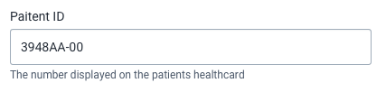

##### Contents

-   [Usage](#usage)
-   [Composition](#composition)
-   [Options](#options)
-   [Types](#types)
-   [States](#states)
-   [Examples in use](#examples-in-use)

---

## Usage

Inputs are used wherever a user needs to input standard text information. Inputs are often used as part of forms. An input can also be used to capture information outside of a form, perhaps as a 'Filter' or 'Search' field.

---

## Composition

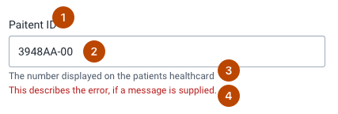

An input is made up of multiple elements, some of which are optional:

1. **Label, optional**
2. **Input element, required**
3. **Help text, optional**
4. **Validation text, optional**

---

## Options

Inputs have several options, each detailed below. All of the options listed below are available for all types of input. Specific options for each type of input are listed in the Types section.

### Labels

Make sure to provide useful label text that is short, concise and describes the intended input.

### Help text

Input fields can include helper text below. This helper text provides guidance to the user. Do not use helper text on every form field, this will be overwhelming to the user. Only include help text for difficult to learn, or one-off inputs.

### Placeholder text

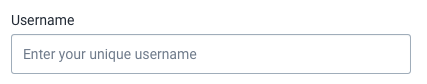

Placeholder text can give the user some guidance on how the field should be used or what kind of information is expected. Do not include critical information in placeholder text, it will not be visible once a user inputs text.

### Width

All input fields are set to 100% width by default, so they will fill the width of their parent container. Alternatively, a custom width can be defined.

It is important that the width of an input reflects the expected content. If an input will be used to enter numbers between 1-1000, the width of the input can be relatively narrow. If an input will be used to enter a long dashboard description, allow for a wider input. The width of an input is a subtle hint to a user that "this input expects this type of content", so use the width to aid the user to enter the right type of content.

### Sizes

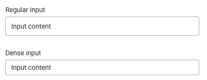

All input types are available in Regular and Dense sizes. Regular sizes are best for applications with plenty of space and few controls, or in forms. Dense sizes work well in data-heavy, complex layouts, especially when using an input as a filter or search field as part of another component.

### Disabled

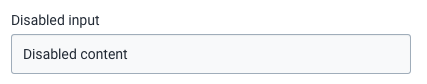

A user cannot edit a disabled input. The content is selectable and can be copied, but it cannot be edited. Use a disabled input whenever a user should, or cannot, edit a field. If it is not obvious to the user why the field is disabled, make sure to inform them.

---

## Types

There are several different types of input, each targeting specific functionality. Use the right type of input that matches the expected user input.

### Text

Text is the default input type and will be used if no other type is specified. Text inputs, by default, accept all textual characters. Remember to perform any necessary validation on the user input.

### Textarea

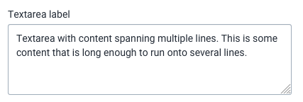

A textarea allows multiple lines of text input. Use a textarea wherever a user needs to input a lot of information. Do not use a textarea if a short, single line of content is expected.

Options for textarea inputs are:

-   **Rows**: the height of the input, defined by the number of rows of text
-   **Resizable**: whether the textarea can be resized by the user or not. Can be set for both width and height.
-   **Autoheight**: if enabled, the texarea will grow in height to adapt to the content.

### Number

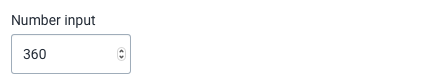

A number input accepts number inputs only. A number input should only be used if you are certain that only numbers should be input, as the input will reject non-number characters.

Options for number inputs are:

-   **Maximum value**: the maximum numerical value that is valid.
-   **Minimum value**: the minimum numerical value that is valid.
-   **Step**: a step value that the inputted number must be divisible by. For example, a step value of 5 means that 10 or 15 is valid, but not 22.

### Password

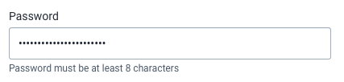

A password input is used only when the user is inputting a password. The users browser may provide additional controls for this input. Make sure to inform the user of any password rules, such as required length or characters, upfront. Do not wait for the user to enter an invalid password before you tell them the rules.

### Email

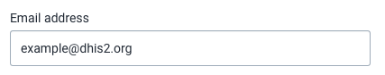

An email input that provides validation, only accepting valid email addresses. Only use an email input where you are certain that email addresses are the only valid content. Make sure to provide information to the user, via placeholder text or help text, of what is valid content. Do not wait until the user makes an error to tell them the rules.

Options for email inputs are:

-   **Multiple**: if enabled, the input will accept multiple email addresses.

### URL

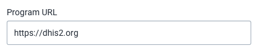

A URL input only accepts valid URLs. Only use a URL input where you are certain that URLs are the only valid content. Make sure to provide information to the user, via placeholder text or help text, of what is valid content. Do not wait until the user makes an error to tell them the rules.

### Telephone

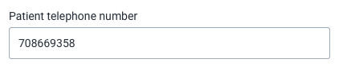

A telephone input accepts any type of content, it does not automatically provide any validation. A telephone input can be useful because it will provide a better experience for mobile users. Only use a telephone input where telephone numbers are the only valid content.

Telephone number formats vary around the world. It can be difficult to set defined rules for valid formats. Be careful not to define too strict rules, otherwise a user may get stuck filling out a form if their telephone number is different than the formats you allow for.

---

## States

An input can display a state to communicate some information to the user about it's current status. There are several different types of state:

### Error

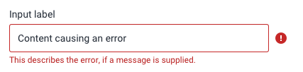

An error is indicated with a change of color and inclusion of an ! icon and an optional error message underneath the input. For guidance on writing error messages, see [Content and Communication](../principles/content-communication.md). This error state should only be triggered on inputs that contain an error. Do not apply to the entire form unless all inputs happen to contain an error.

### Valid

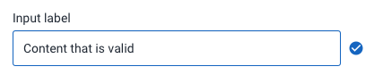

A valid value can be communicated using the 'valid' input field state. This state shows a check icon and adjusts the element color to communicate to the user that the inputted value is value. Only use this field if there are rules/criteria the input must fulfill. Do not use valid inputs for all inputs, and never use a valid input without actually checking for validity.

### Loading

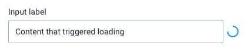

The loading state is useful for communicating to the user that the application is checking the user entered value and another state will follow, either valid or error. Only use loading states where loading is actually taking place.

---

## Examples in use

WIP

<!-- 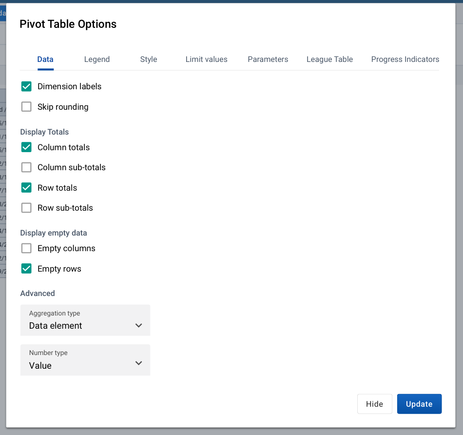
*Checkboxes are used for toggling on/off the display of certain elements. Checkbox status True/On indicates that this element will display* -->
