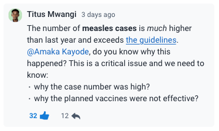
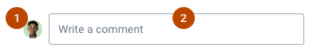
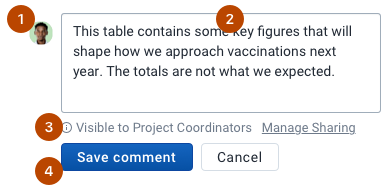
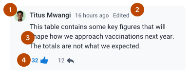
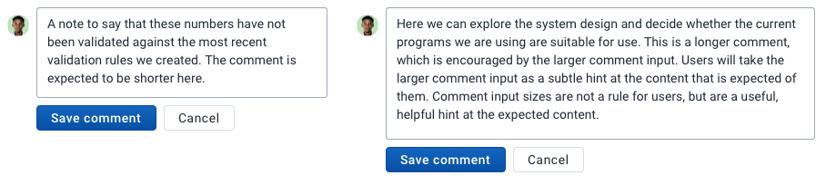
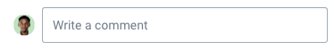
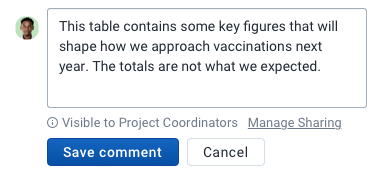
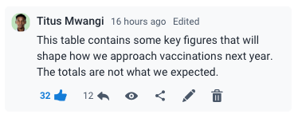

|                      |                                                              |
| -------------------- | ------------------------------------------------------------ |
| **Component**        | Comment                                                      |
| **Type**             | Molecule ([?](http://atomicdesign.bradfrost.com/chapter-2/)) |
| **Design Spec**      | _pending_                                                    |
| **Working Examples** | _pending_                                                    |
| **Status**           | `Waiting for build`                                          |

---

# Comment

A comment is used to display and write user generated input. A comment is always attached to an item and must have an author.

##### Contents

-   [Usage](#usage)
-   [Composition](#composition)
-   [Options](#options)
-   [States](#states)
-   [Examples in use](#examples-in-use)

---

## Usage

A comment is used wherever a user can add textual information to something. A comment is attached to another element: a user can comment on a bar chart or comment on a validation result.

A comment must have an author: the user that wrote the comment. Do not use comments for unattributed information such as generic notes on an item that have no author and can be edited by any user. A comment is owned by its author and cannot be edited by another user, so only use comments for user inputted content. Never automatically create comments on a users behalf.

Comments can be displayed together in a Conversation, allowing users to communicate directly on an item (e.g. bar chart or validation result).

---

## Composition

The composition of a comment depends on its [state](#states).

### Empty

1. **Avatar, required:** the [avatar](../atoms/avatar.md) of the current user.
2. **Input, required:** where the user inputs content.

### Active

1. **Avatar, required:** the [avatar](../atoms/avatar.md) of the current user.
2. **Input, required:** where the user inputs content.
3. **Extras, optional:** a flexible space that can display any content to help the user or provide extra functionality such as sharing settings.
4. **Actions, required:** action buttons for saving and dismissing the current active comment.

### Display

1. **Avatar, required:** the [avatar](../atoms/avatar.md) of the current user.
2. **Metadata, required:** the comment author, timestamp and a flag to indicate if the comment has been edited.
3. **Content, required:** the content of the comment.
4. **Actions, optional:** actions for the comment. Some actions are only available for the current user. All actions are optional and custom actions can be used.

---

## Options

### Width

The width of a comment should indicate how much text a user is expected to write. A narrow comment input hints to the user that a short, concise comment is appropriate. Wider comment inputs with more space invite longer content. Consider the intended usage, as well as the rest of the user interface, when defining the size of the comment.

---

## States

A comment has three states: empty, active and display. The empty and active states are used depending on the current user interaction. The display state is used to display comments that have been saved.

### Empty

The empty state is used when the user has not entered any information or interacted with the comment. The empty state invites the user to add their comment, providing a reminder from the user avatar that this comment belongs to them.

Empty is the default state of a comment input.

#### Placeholder text

The placeholder text of an empty comment can, and should be, customized to the context. "Write a comment" is a generic way of inviting the user to add their comment. In a more specific context: a patient journal, the placeholder "Add a comment to this journal" could be used.

### Active

The active state is used when the user is interacting with the comment input. The active state shows more information, expands the text input to invite more content and gives the user the ability to save or cancel the current comment.

When a user interacts with a comment input by entering information, the comment remains in active state until cancelled or saved.

#### Extras

The active state can display extra information specific to an app or context. For example, if a user can manage who can see their comment (sharing settings), these sharing settings may be available from the extras area.

The extras area should be used for information that the user should read before they save the comment. Extras are displayed between the comment input and the action buttons to support this.

### Display

The display state is used to display a saved comment. Display comments display metadata about the comment, the comment content and additional actions.

#### Actions

Default actions are provided, such as like, reply, edit and delete. Some actions are only available to the owner of the comment: edit and delete.

Custom actions can be included in display comments. Ensure that actions relate directly to the comment. Do not place actions inside a display comment that relate to the whole page or another component.

---

## Examples in use

_Coming soon_
