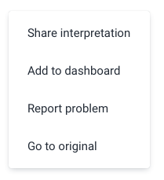
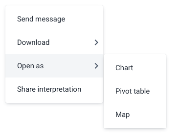
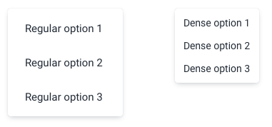
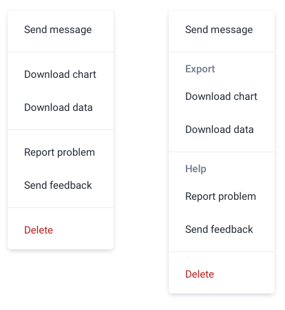
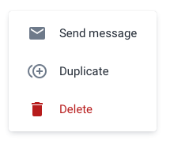
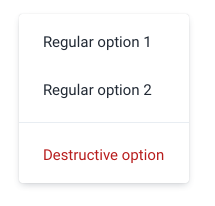
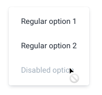
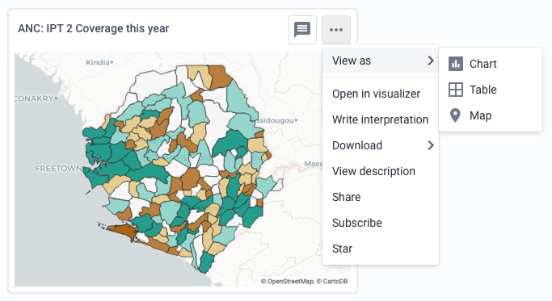

|                      |                                                                                 |
| -------------------- | ------------------------------------------------------------------------------- |
| **Component**        | Menu                                                                            |
| **Type**             | Molecule ([?](http://atomicdesign.bradfrost.com/chapter-2/))                    |
| **Design Spec**      | [Link](https://www.sketch.com/s/0nGd0/a/DQAppk)                                 |
| **Working Examples** | [Link](https://ui.dhis2.nu/demo/?path=/story/actions-menu-flyout-menu--default) |
| **Status**           | `Ready to use`/`Waiting for update`                                             |

---

# Menu

A menu provides user access to options that are available when clicking the menu toggle. A menu toggle can be almost anything: button, table row, avatar etc.

##### Contents

-   [Usage](#usage)
-   [Options](#options)
-   [Types](#types)
-   [States](#states)
-   [Examples in use](#examples-in-use)

---

## Usage

Use menus to provide access to options and actions where space is limited and displaying all the options would be impractical. For example, providing access to a range of actions for every dashboard item displayed. Containing all those actions in menus keeps the page manageable.

The menu component is flexible in where it can be used and its contents can be flexible too. However, the most common use case is a menu containing menu items.

Make sure the menu item labels are short and easy to understand. One word is often enough to describe an action or option. Do not use sentences as labels. Some examples of good menu item labels:

-   "Save"
-   "Open as map"
-   "Export PDF"
-   "Duplicate"

### Menu levels

Splitting menus into several levels with child menus makes sense when there are a lot of options that can be grouped together. An example may be an option in level 1 menu of 'Download' that has several different download formats as child menu items. Make sure that child menu items relate to their parent item, otherwise a user will struggle to discover them. A menu item with children is not selectable/actionable itself, it serves only as a container for the child elements. Try to keep menus to a maximum of 1, 2 or 3 levels, anything more than this can easily confuse the user.

### Ordering items

There is no enforced ordering of menu items, they should be presented in order of relevance. Put the most commonly used items at the top of the menu for easy discovery and access.

---

## Options

### Size

Menus are available in regular or dense sizes. Use dense menus in data-heavy applications used by users comfortable with technology. Use regular menus in apps that are less complex or have few controls.

### Dividers & Section Headers

Items in a menu can be split into separate sections by using dividers. Group relevant menu items together to help the user understand the options quickly. A divider can be used alone. If using a section header a divider will be automatically included. Try not to group single menu items together. An exception to this is a critical destructive menu item, like 'Delete', which can be separated from other menu items.

### Icons

A menu item can include an icon to help the user understand or recognize the option. An icon should support the menu item text and be simple enough to be understood in a dense UI. Icons add a lot of visual noise a menu, so only include them where they will help the user. Do not include icons only for visual reasons, the icon must functionally support the users understanding. Do not use complex icons. All menu items in a single menu do not need to have icons.

---

## Types

### Destructive

Destructive menu items should be used for critical, destructive actions such as 'Delete', 'Remove' or 'End process'. Do not use destructive menu items for actions that are simply important, they must also be destructive in nature. A menu should, ideally, only have one destructive action. Using a divider to separate normal and destructive options helps the user to understand that the destructive options is different from the rest of the options.

---

## States

### Disabled

Menu items should be disabled when they are not available, but could be available if something changes. Do not include menu items that will never be available, this will confuse a user. Instead, remove them from the menu.

---

## Examples in use

_Complex actions and options for this embedded analytical object are available in a menu. If all of these options were available and visible all the time, for multiple objects, it would take up a lot of space and be very difficult to understand and use._
