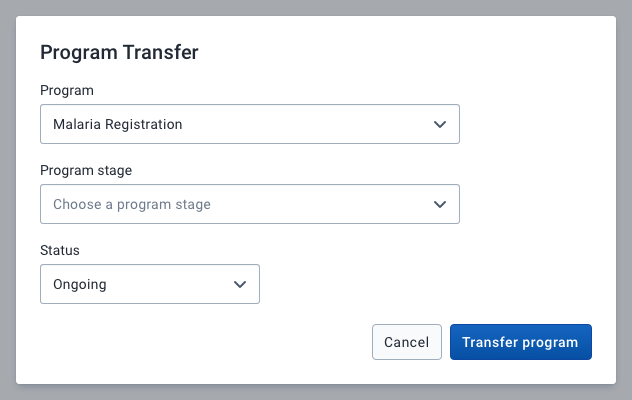
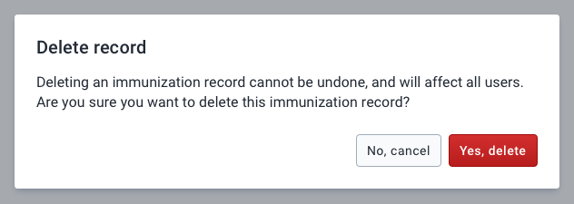
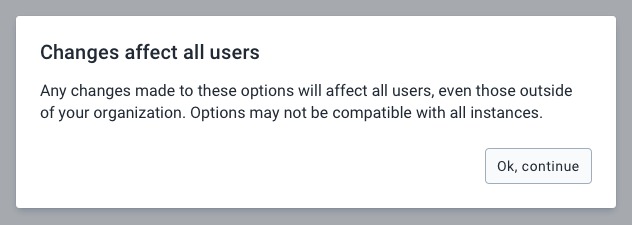
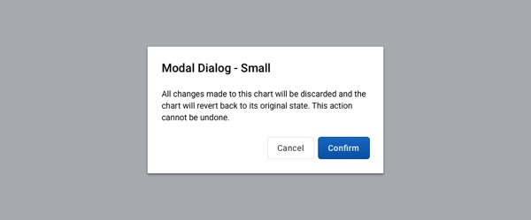
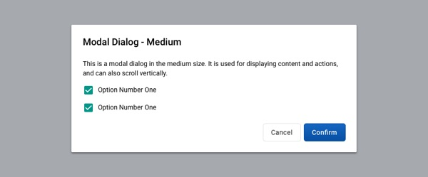
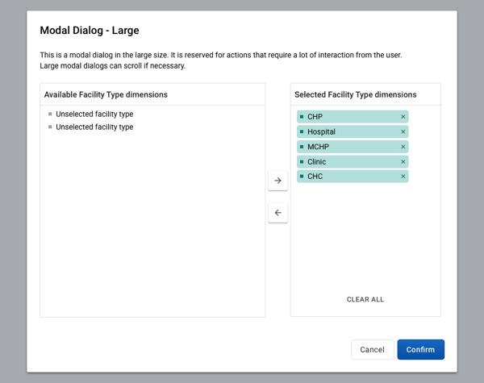
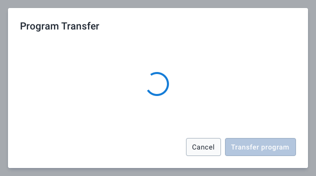
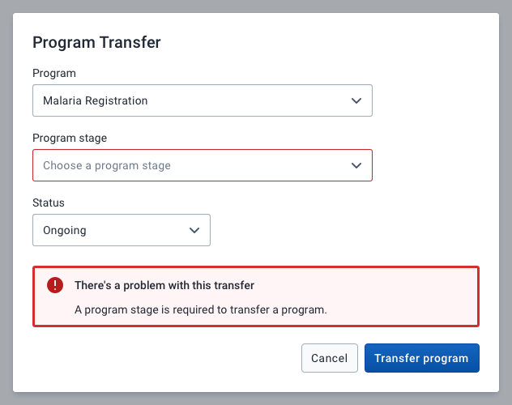
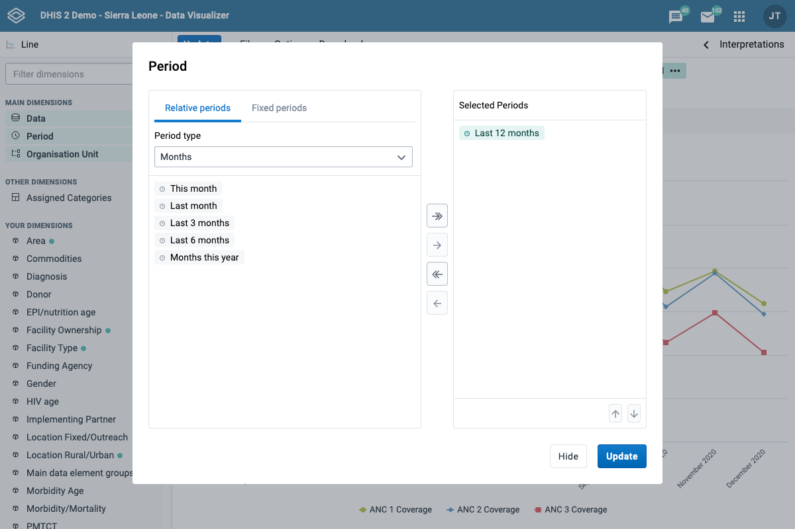
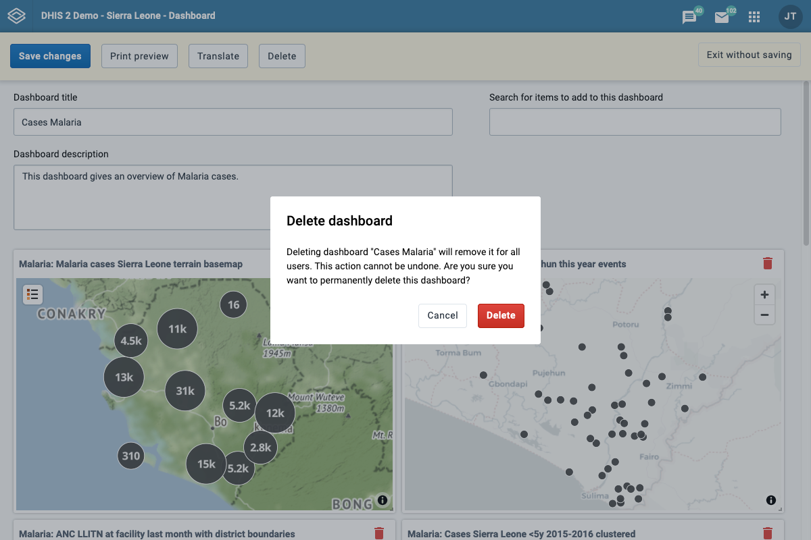

|                      |                                                                             |
| -------------------- | --------------------------------------------------------------------------- |
| **Component**        | Modal                                                                       |
| **Type**             | Molecule ([?](http://atomicdesign.bradfrost.com/chapter-2/))                |
| **Design Spec**      | [Link](https://sketch.cloud/s/DwkDk/a/PbWMjx)                               |
| **Working Examples** | [Link](https://ui.dhis2.nu/demo/?path=/story/layout-modal--default-content) |
| **Status**           | `Ready to use`                                                              |

---

# Modal

A modal focuses user attention on a single task or piece of information inside a container. A modal blocks the rest of the application until it is dismissed.

##### Contents

-   [Usage](#usage)
-   [Options](#options)
-   [States](#states)
-   [Examples in use](#examples-in-use)

---

## Usage

A modal should be used to focus user attention on a single task or piece of information. Modals take over the entire screen and should be used sparingly to avoid interrupting a user's flow too often.

Use a modal in the following cases:

-   to collect short, focussed user input that is blocking progress
-   to present critical information that a user needs to acknowledge before continuing
-   to ask the user to confirm a destructive action that cannot be undone

Do not use a modal in the following cases:

-   to display unrelated or non-critical information; use an [alert bar](./alertbar.md) or a [notice box](./notice-box.md) instead
-   to display complex, workflows that span multiple screens; navigate to a new, full page in the app instead

There are three different ways modals should be used:

#### 1. **Task-based**

A modal with inputs and controls to perform a short, focused task. Task-based modals should always be user-initiated and should not interrupt user flow without specific user intention.

#### 2. **Confirmation**

A modal that asks the user to confirm a destructive action. Confirmation modals should clearly outline the action and it's consequences and provide clear choices to confirm or cancel the action.

#### 3. **Acknowledgement**

A modal presenting information that a user must acknowledge before progressing. No user input is required, apart from a confirmation that the user has read the information. These types of modals should be used very sparingly and only where it is absolutely critical that a user is presented with the information before continuing. Note that presenting the information in a modal does not guarantee that it will be read.

### Actions

A modal must contain one or more actions. Modal actions are always presented as buttons at the bottom of a modal. For acknowledgement modals, a single action, such as "Continue", can be used. Make sure the modal actions clearly communicate what will happen when triggering them. For guidance on writing clear, concise actions, see the [Content and Communication guidelines](../principles/content-communication.md).

### Title

A modal should present a clear, concise title that summarizes the content or task presented to the user. Avoid long titles that may span several lines, use an introductory paragraph inside the modal instead.

---

## Options

### Alignment

A modal can be aligned to the **top**, **middle** or **bottom** of a window. The default alignment is top. Top aligned modals are useful where the content may change inside because the modal will remain anchored to the same position on the screen. Middle alignment is useful for acknowledgement or confirmation modals that do not contain dynamic content.

### Size

A modal can be **small**, **medium** or **large** size. The size of the modal should match the content inside. Short, focused content should use a small modal. More complex, detailed content should use a large modal.

#### Small, 400px wide

#### Medium, 600px wide

#### Large, 800px wide

---

## States

Besides the default state, a modal can also be in a **loading** or **error** state.

### Loading

A modal that is loading it's content should display an empty container, ideally with a title, and a progress spinner to indicate the loading. A modal can still be dismissed while it is loading, so a button to hide or cancel the modal should not be disabled.

### Error

An error state is used whenever there is an error with the content in a modal that is preventing progress. An error state displays a notice box below the modal content. With scrollable modals, make sure to automatically scroll the modal to display the notice box to ensure the user is aware of the error. If possible, the component causing the error should also display it's error state.

---

## Examples in use

_A modal is used to select period items in Data Visualizer app. Presenting the task in a modal focuses the user attention. Using a modal means the user doesn't need to navigate away from the current page, having these controls on a separate page would feel disconnected and an excessive amount of navigation to set up a visualization. Including the controls on the page itself would present an overly complex, cluttered interface. A modal is an acceptable compromise._

_Deleting a dashboard displays a confirmation modal. Deleting a dashboard is a critical action that could have serious consequences. The confirmation is presented in a modal to focus the users attention on the question: do you really want to delete this dashboard? Notice that the message text is concise and the actions are clear, there is no space for uncertainty with critical actions._
