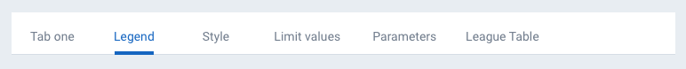
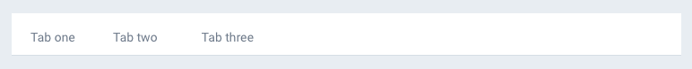
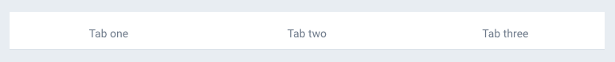
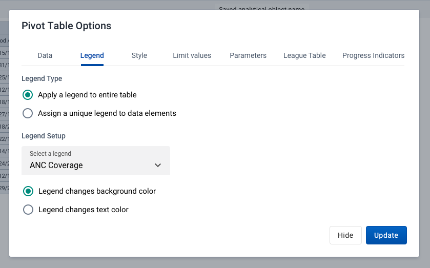

|                      |                                                                                 |
| -------------------- | ------------------------------------------------------------------------------- |
| **Component**        | Tabs                                                                            |
| **Type**             | Molecule ([?](http://atomicdesign.bradfrost.com/chapter-2/))                    |
| **Design Spec**      | [Link](https://sketch.cloud/s/DwkDk/GmKbAL5)                                    |
| **Working Examples** | [Link](https://ui.dhis2.nu/demo/?path=/story/navigation-tab-bar--default-fluid) |
| **Status**           | `Ready to use`                                                                  |

---

# Tabs

Tabs act as containers for content. Tabs are used to divide content into categories and/or sections.

##### Contents

-   [Usage](#usage)
-   [Types](#types)
-   [Examples in use](#examples-in-use)

---

## Usage

-   Use tabs to split related content into separate sections.
-   Each tab should contain content that relates to one another, but the content should not overlap.
-   Tabs are especially useful for splitting up content that may be relevant to different user groups, instead of displaying overwhelming amounts of information on a single page.
-   Do not use tabs to compare content.
-   Do not use tabs for sequential content that needs to be done in order.
-   Do not use tabs for content that needs to be viewed at the same time.
-   The number of tabs is less important than splitting content into understandable, predictable groups. Do not group together unrelated content in order to reduce tab count. Users struggle more with unpredictable tabs than too many tabs.

### Naming

Give tabs short, understandable names. Try to find a word or very short phrase that summarizes the content. If you cannot find a suitable word this may mean you are trying to fit too much content under a single tab. The content of a tab should be obvious from its name.

For example:
Do use "Legends" instead of "Set up legends",
Do use "Data analysis" instead of "Options for analysis of data",

Do not repeat a term across tabs. If tabs are used inside a 'Options' modal, it is enough to use tab names "Data", "Legend", "Style". Do not repeat 'options' for all, e.g. "Data options", "Legend options" etc.

---

## Types

### Fluid vs. Fixed

The default tab style is fluid, where each tab width is defined by its name:

Fixed tabs always fill the width of their container:

Fluid tabs should be used in most situations. Fixed tabs are useful when there is an either/or selection between two modes. For example, fixed tabs may give the user an option between 'Table' or 'Form' entry for the same data entry screen.

---

## Examples in use

_Tabs are used inside the 'Options' modal in Pivot Tables. Different categories of option are split into logical categories. Attempting to list all these options in a single screen would be overwhelming for a user._
