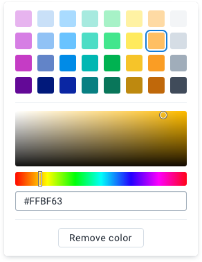

|                      |                                                                         |
| -------------------- | ----------------------------------------------------------------------- |
| **Component**        | Color Picker                                                            |
| **Type**             | Organism ([?](http://atomicdesign.bradfrost.com/chapter-2/))            |
| **Design Spec**      | [HTML & CSS Spec](https://sleepy-yalow-3c0c76.netlify.com/color-picker) |
| **Working Examples** | _pending_                                                               |
| **Status**           | `Waiting for build`                                                     |

---

# Color Picker

A user can use the color picker to select a color from predefined palettes or by entering custom values.

##### Contents

-   [Usage](#usage)
-   [Options](#options)
-   [Examples in use](#examples-in-use)

---

## Usage

Use a color picker wherever a user needs to select a color. A color picker provides an interactive experience, allowing a user to explore available color options before making a selection. A color picker is always the preferred method for color selection (instead of, for example, entering raw color hex codes).

A color picker can be opened from various triggers: buttons, selects or other elements. The triggering element is not defined in the color picker component. Picking a color as part of a form would make a Select element a good choice. Picking a color as part of a complex component may be best done via a small button. Use the triggering element that makes sense in the application use case.

---

## Options

### Predefined colors

By default, a color picker displays columns or rows of predefined colors. Use predefined colors to give a user a selection of sensible default colors to choose from. Make sure to provide consistent predefined colors in the same column/row layout throughout a single app, a user may want to select the same color for multiple elements.

The color picker component is supplied with default predefined colors. Use these defaults unless there is a specific reason to redefine the predefined colors.

Predefined colors can be omitted, but only where there is a good reason to do so. In the majority of use cases, predefined colors should be available.

### Custom color selection

A color picker can display custom color selection controls. Use the custom color controls to allow a user to select a color not available in the predefined colors. Only display the custom color controls for users that need to make a custom selection, as the interface can be imposing and confusing to users with low tech-literacy.

---

## Examples in use

<!--  -->

_Coming soon_.
